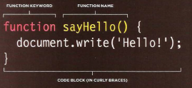
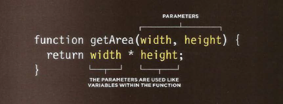

# Learning to program with JavaScript involves:
1. Understanding some basic programming concepts and
the terms that JavaScript programmers use to
describe them.

2. Learning the language itself, and, like all languages, you need to know its vocabulary
and how to structure your sentences.

3. Becoming familiar with how it is applied by looking at examples of how JavaScript is commonly used in websites today.

# How Java Script makes WEB page more interactive

1. **Access content**
you can use JavaScript to select any element,attribute,or text from an HTML page. 
2. **Modify content**
you can use JavaSpcript to add element,attribute,and text to the page or remove them. 
3. **Program Rules**
you can specify a set of steps for the browser to follow which allows it to access or change the content of a page.
4. **React to Event**
you can specify that a script should run when a specific event has occurred 
<br>
<br>

## EXAMPLES OF JAVASCRIPT IN THE BROWSER

Being able to change the content of an HTML page while it is loaded in
the browser is very powerful. The examples below rely on the ability to:
* **Access** the content of the page.
* **Modify** the content of the page.
* **Program** rules or instructions the browser can follow.
* **React** to events triggered by the user or browser.


## SLIDESHOWS
 They allow more content to be displayed
within a limited amount of space.
* **React:** Script triggered when the page loads.
* **Access:** Get each slide from the slideshow.
* **Modify:** Only show the first slide (hide others).
* **Program:** Set a timer: when to show next slide.
* **Modify:** Change which slide is shown.
* **React:** When user clicks button for different slide.
* **Program:** Determine which slide to show.
* **Modify:** Show the requested slide.

## FORMS
Validating forms (checking whether they have been
filled in correctly) is important when information is
supplied by users. JavaScript lets you alert the user
if mistakes have been made. It can also perform
sophisticated calculations based on any data entered
and reveal the results to the user.

* **React:** User presses the submit button when they
have entered their name.
* **Access:** Get value from form field.
* **Program:** Check that the name is long enough.
* **Modify:** Show a warning message if the name is not long enough.
<br>
<br>

Script are made up of instructions on copmuter can follow step-by-step.A browser may use different parts of the script depending on how the user interacts with the web page.Scripts can run different section oh the code in response to the situation around them.

# WRITING A SCRIPT
To write a script, you need to first
state your goal and then list the
tasks that need to be completed in
order to achieve it.

## Start with the big picture of what you want to achieve, and break that down into smaller steps.


1. DEFINE THE GOAL
First, you need to define the task you want to
achieve. 

2. DESIGN THE SCRIPT
To design a script you split the goal out into a series
of tasks that are going to be involved in solving it
You can then write down individual steps that the
computer needs to perform in order to complete
each individual task (and any information it needs to
perform the task)


3. CODE EACH STEP
Each of the steps needs to be written in a
programming language that the compu ter
understands. In our case, this is JavaScript.

## we are focussing on the JavaScript
language and how it is used in web browsers.
Just like learning any new language, you need
to get to grips with the:
* Vocabulary: The words that computers
understand.
* Syntax: How you put those words together to
create instructions computers can follow
Along with learning the language itself.

# SKETCHING OUT THE TASKS IN A FLOWCHART

Often scripts will need to perform different tasks in different situations.You can use flowcharts to work out how the tasks fit together. The flowcharts show the paths between each step.


# EXPRESSIONS
An expression evaluates into (results in) a single value. Broadly speaking there are two types of expressions.
 
 1. EXPRESSIONS THAT JUST ASSIGN A
VALUE TO A VARIABLE

In order for a variable to be useful, it needs to be
given a value. As you have seen, this is done using
the assignment operator (the equals sign).
```var color = 'beige';```
The value of color is now beige.When you fi rst declare a variable using the``` var```keyword, it is given a special va lue of undefined.This will change when you assign a value to it.Technically, undefined is a data type like a number,string, or Boolean.

2. EXPRESSIONS THAT USE TWO OR MORE VALUES TO RETURN A SINGLE VALUE.

You can perform operations on any number of
individual values  to determine a
single value. For example:
```var area = 3 * 2;```
The value of area is now 6.Here the expression 3 * 2 evaluates into 6. This example also uses the assignment operator, so the result of the expression 3 * 2 is stored in the variable
called area.
<br>
<br>

## OPERATORS

Expressions rely on things called operators; they allow programmers to create a single value from one or more values.

* ASSIGNMENT OPERATORS
Assign a value to a variable
```color = 'beige';```
The value of color is now beige.

* COMPARISON OPERATORS
Compare two values and return true or false
```buy = 3 > 5;```
The value of buy is false.

* ARITHMETIC OPERATORS
Perform basic math
```area = 3 * 2;```
The value of area is now 6.

* LOGICAL OPERATORS
Combine expressions and return true or false
```buy= (5 > 3) && (2 < 4);```
The value of buy is now true.

* STRING OPERATORS
Combine two strings
```greeting= 'Hi 1 + 'Mol ly';```
The value of greeting is now Hi Molly.

# ARITHMETIC OPERATORS

JavaScript contains the following mathematical
operators, which you can use with numbers.
You may remember some from math class.


 **Example USING ARITHMETIC OPERATORS**


# STRING OPERATOR
There is just one string operator: the+ symbol.
It is used to join the strings on either side of it.

**Example USING STRING OPERATORS**


<br>
<br>

# Browsers require very detailed instructions about what we want them to do. Therefore, complex scripts can run to hundreds (even thousands) of lines. Programmers use functions, methods, and objects to organize their code.


## WHAT IS A FUNCTION?
Functions let you group a series of statements together to perform a specific task. 

Grouping together the The steps that the function 
statements that are required to needs to perform in order to of a function in the JavaScript
answer a question or perform a perform its task are packaged file. It is called **updateMessage ()**.

## A BASIC FUNCTION


# Declaring A Function
To create a function you need to give it a name then write the statement that achieve the task you want to make it



# Calling A Function
When you finished from writing the statement of the function you can run with just one line of the code.


# Declaring Function that need information
There are functions in order to work the task that build for it they need some information.

