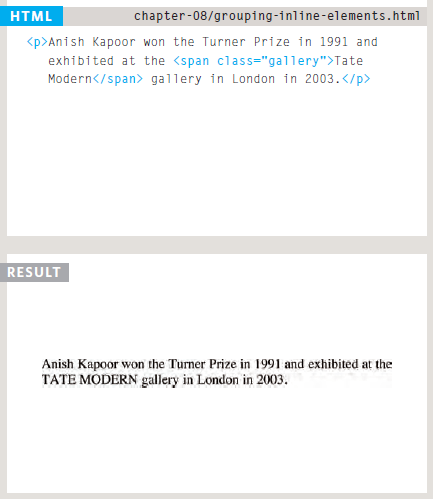
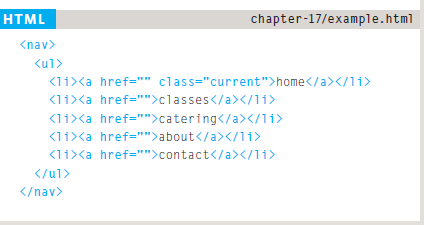

# Introductory HTML and JavaScript.


<br>

### We come across all kinds of documents every day of our lives. Newspapers, insurance forms, shop catalogues... the list goes on.

<br>
Many web pages act like electronic versions of these
documents. For example, newspapers show the same stories
in print as they do on websites; you can apply for insurance
over the web; and stores have online catalogs and e-commerce
facilities.

<br>
In all kinds of documents, structure is very important in helping
readers to understand the messages you are trying to convey
and to navigate around the document. So, in order to learn how
to write web pages, it is very important to understand how to
structure documents.
<br>
<br>

# How Pages Use Structure
* Structure helps readers
understand the stories in the
newspaper.
* The structure is very similar
when a news story is viewed
online (although it may also
feature audio or video).


<br>
<br>

# Structuring Word Documents

* The use of headings and subheadings in any document
often reflects a hierarchy of information. 

* This might be expanded upon under subheadings lower down on the page. When using a word
processor to create a document, we separate out the text to give it structure. Each topic might
have a new paragraph, and each section can have a heading to describe what it covers.


<br>
<br>

# HTML Describes the Structure of Pages

The HTML code (in blue) is made up of characters that live inside angled brackets — these are called HTML elements. Elements are usually made up of two tags: an opening tag and a closing tag. (The closing tag has an extra forward slash in it.) Each HTML element tells the browser something about the information that sits between its opening and
closing tags.


<br>
<br>

# HTML Uses Elements to Describe the Structure of Pages

Let's look closer at the code.There are several different elements. Each element has an opening tag and a closing tag.


Tags act like containers. They tell you
something about the information that lies
between their opening and closing tags.


<br>
<br>

# Attributes Tell Us More About Elements

Attributes provide additional information
about the contents of an element. They appear
on the opening tag of the element and are
made up of two parts: a name and a value,
separated by an equals sign.


The majority of attributes can only be used on certain elements, although a few attributes (such as lang) can appear on any element.Most attribute values are either pre-defined or follow a
stipulated format. We will look at the permitted values as we introduce each new attribute.
The value of the lang attribute is an abbreviated way of specifying which language is used inside the element that all browsers understand.
<br>
<br>

# Body, Head & Title

## 1. Body
You met the **body** element
in the first example we created.
Everything inside this element is
shown inside the main browser
window.


## 2. Head
Before the **body** element you
will often see a **head** element.
This contains information
about the page (rather than
information that is shown within
the main part of the browser
window that is highlighted in
blue on the opposite page).
You will usually find a **title**
element inside the **head**
element.

## 3. Title
The contents of the **title**
element are either shown in the
top of the browser, above where
you usually type in the URL of
the page you want to visit, or
on the tab for that page (if your
browser uses tabs to allow you
to view multiple pages at the
same time).


<br>
<br>

# The Evolution of HTML
Since the web was first created, there have
been several different versions of HTML.
Each new version was designed
to be an improvement on the
last (with new elements and
attributes added and older code
removed).

## 1. HTML 4 Released 1997
With the exception of a few
elements added in HTML5
(which have been highlighted),
the elements you have seen in
 were all available in
HTML 4.
Although HTML 4 had some
presentational elements to
control the appearance of pages,
authors are not recommended to
use them any more.

## 2. XHTML 1.0 Released 2000
In 1998, it was a language called XML
Has been published. Purpose
It was to allow people to write
New markup languages. Ago
HTML was the most commonly used
The markup language around, it was
they decided that HTML 4 should be
Paraphrased to follow the rules
From XML and renamed
XHTML. This means that
The authors had to follow some new,
Stricter rules about writing
Tick on.

* Every element needed a
closing tag (except for empty
elements such as img ).

* Attribute names had to be in
lowercase.
* All attributes required a value,
and all values were to be
placed in double quotes.
* Deprecated elements should
no longer be used.
* Every element that was
opened inside another
element should be closed
inside that same element.

## 3. HTML5 Released 2000
In HTML5, web page authors do
not need to close all tags, and
new elements and attributes will
be introduced. At the time of
writing, the HTML5 specification
had not been completed, but
the major browser makers had
started to implement many of
the new features, and web page
authors were rapidly adopting
the new markup.
<br>
<br>

## Doctype 
 Because there have been several versions of HTML, each web page should begin with a :

* DOCTYPE declaration to tell a
browser which version of HTML
the page is using (although
browsers usually display the
page even if it is not included).
* The use of a DOCTYPE
can also help the browser to
render a page correctly.
Because XHTML was written
in XML, you will sometimes.
* See pages that use the XHTML
strict DOCTYPE start with
the optional XML declaration.
Where this is used, it should be
the first thing in a document.
There must be nothing before it,
not even a space. 


<br>
<br>

## Comments in HTML
If you want to add a comment
to your code that will not be
visible in the user's browser, you
can add the text between these
characters:

```<!-- comment goes here --> ```

Why It is a good idea to add
comments to your code
* because,
no matter how familiar you
are with the page at the time
of writing it, when you come
back to it later (or if someone
else needs to look at the code),
comments will make it much
easier to understand.
* Although comments are not
visible to users in the main
browser window, they can be
viewed by anyone who looks at
the source code behind the page.
* Comments can also be used
around blocks of code to stop
that code from being displayed
in the browser.
<br>
<br>

## Class Attribute
* Every HTML element can
also carry a class attribute.

* Sometimes, rather than uniquely
identifying one element within
a document, you will want a
way to identify several elements
as being different from the
other elements on the page.
To do this you can use the
class attribute. Its value
should describe the class it
belongs to.

* The class attribute on any
element can share the same
value.


<br>
<br>

## Block Elements
Some elements will always
appear to start on a new line in
the browser window. These are
known as block level elements.
Examples of block elements are
(```<h1>, <p>, <ul>, and <li>```).

## Inline Elements
Some elements will always
appear to continue on the
same line as their neighbouring
elements. These are known as
inline elements.
Examples of inline elements are
<```<a>, <b>, <em>, and ```).
<br>
<br>

## Grouping Text & Elements In a Block

**1.** **```<div> ```**

The ```<div>``` element allows you to
group a set of elements together
in one block-level box.


<br>
<br>

## Grouping Text & Elements Inline

**```<span> ```**

The ```<span>``` element acts like
an inline equivalent of the ```<div>```
element. It is used to either:
1.  Contain a section of text
where there is no other suitable
element to differentiate it from
its surrounding text
2.  Contain a number of inline
elements
The most common reason why
people use <span> elements
is so that they can control the
appearance of the content of
these elements using CSS.

**```<span>```** elements:
*  To explain the purpose of this
```<span>``` element
*  So that CSS styles can be
applied to elements that
have specific values for these
attributes.


<br>
<br>

## IFrames

**```<iframe>```**

An iframe is like a little window
that has been cut into your
page — and in that window you
can see another page. The term
iframe is an abbreviation of inline
frame.

An iframe is created using the
```<iframe> ```element. There are a
few attributes that you will need
to know to use it:
* **src**
The src attribute specifies the
URL of the page to show in the
frame.
* **height**
The height attribute specifies
the height of the iframe in pixels.
* **width**
The width attribute specifies
the width of the iframe in pixels.


<br>
<br>

# Information About Your Pages

**1.** ```<meta>```

The ```<meta>``` element lives
inside the ```<head>``` element and
contains information about that
web page.
* It is not visible to users but
fulfills a number of purposes
such as telling search engines
about your page, who created
it, and whether or not it is time
sensitive.
* The ```<meta>``` element is an empty
element so it does not have a
closing tag. It uses attributes to
carry the information.
* The most common attributes
are the name and content
attributes, which tend to be
used together. These attributes
specify properties of the entire
page. The value of the name
attribute is the property you
are setting, and the value of the
content attribute is the value
that you want to give to this
property.

Some defined values for this
attribute that are commonly
used are:

    1. description
     This contains a description of the page.
    2. keywords
      This contains a list of commaseparated
      words that a user might search on to 
      find the page.
    3. robots
      This indicates whether search
      engines should add this page
      to their search results or not.

The ```<meta>``` element also
uses the http-equiv and
content attributes in pairs.Each one has a
different purpose:
* author
This defines the author of the
web page.
* pragma
This prevents the browser from
caching the page. (That is,
storing it locally to save time
downloading it on subsequent
visits.)
* expires
Because browsers often cache
the content of a page, the
expires option can be used
to indicate when the page
should expire (and no longer be
cached).
<br>
<br>

## Traditional HTML Layouts

For a long time, web page authors used ```<div>``` elements to group
together related elements on the page (such as the elements that form a
header, an article, footer or sidebar). Authors used class or id attributes
to indicate the role of the ```<div>``` element in the structure of the page.


When coding a site like this,
developers would usually put
these main sections of the page
inside ```<div>``` elements and use
the class or id attributes to
indicate the purpose of that part
of the page.
<br>
<br>

## New HTML5 Layout Elements
HTML5 introduces a new set of elements that allow you to divide up the
parts of a page. The names of these elements indicate the kind of content
you will find in them. They are still subject to change, but that has not
stopped many web page authors using them already.


The point of creating these
new elements is so that web
page authors can use them to
help describe the structure of
the page.
<br>
<br>

## Headers & Footers
```<header> <footer>```

The ```<header>``` and ```<footer>```
elements can be used for:
* The main header or footer
that appears at the top or
bottom of every page on the
site.
* A header or footer for an
individual ```<article>``` or
```<section>``` within the page.


<br>
<br>

## Navigation ```<nav>```
The ```<nav>``` element is used to
contain the major navigational
blocks on the site such as the
primary site navigation.



## Articles ```<article>```
The ```<article>``` element acts as
a container for any section of a
page that could stand alone and
potentially be syndicated.

This could be an individual
article or blog entry, a comment
or forum post, or any other
independent piece of content.
<br>
<br>


# Who is the Site For?
Every website should be designed for the
target audience—not just for yourself or the
site owner. It is therefore very important to
understand who your target audience is.

It might be helpful to ask some
Questions about people or companies
They are expected to be interested in
Your site's topic such as:

## Target Audience: individuals
* What is the age range of your target audience?
* Will your site appeal to more women or men? What is the mix?
* Which country do your visitors live in?
* Do they live in urban or rural areas?
* What is the average income of visitors?
* What level of education do they have?
* What is their marital or family status?
* What is their occupation?
* How many hours do they work per week?
* How often do they use the web?
* What kind of device do they use to access the web?

## Target Audience: Companies
* What is the size of the company or relevant department?
* What is the position of people in the company who visit your site?
* Will visitors be using the site for themselves or for someone else?
* How large is the budget they control?

# Why People Visit YOUR Website
Now that you know who your visitors are, you
need to consider why they are coming. While
some people will simply chance across your
website, most will visit for a specific reason.

Your content and design should
be influenced by the goals of
your users.
To help determine why people
are coming to your website,
there are two basic categories of
questions you can ask:

1: The first attempts to discover
the underlying motivations for
why visitors come to the site.

2: The second examines the
specific goals of the visitors.
These are the triggers making
them come to the site now.

## 1. Key Motivations
* Are they looking for general entertainment or do they need to achieve a specific goal?

* If there is a specific goal, is it a personal or professional one?

* Do they see spending time on this activity as essential or a luxury?

## 2. Specific Goals
* Do they want general information / research (such as background on a topic /company), or are they after something specific (such as a
particular fact or information on a product)?

* Are they already familiar with the service or product that you offer or do they need to be introduced to it?

* Are they looking for time sensitive information, such as the latest news or updates on a particular topic?

* Do they want to discover information about a specific product or service to help them decide whether to buy it or not?

* Do they need to contact you? If so, can they visit in person
(which might require opening hours and a map)? Or might
they need email or telephone contact details?

<br>
<br>

# Learning to program with JavaScript involves:
1. Understanding some basic programming concepts and
the terms that JavaScript programmers use to
describe them.

2. Learning the language itself, and, like all languages, you need to know its vocabulary
and how to structure your sentences.

3. Becoming familiar with how it is applied by looking at examples of how JavaScript is commonly used in websites today.

# How Java Script makes WEB page more interactive

1. **Access content**
you can use JavaScript to select any element,attribute,or text from an HTML page. 
2. **Modify content**
you can use JavaSpcript to add element,attribute,and text to the page or remove them. 
3. **Program Rules**
you can specify a set of steps for the browser to follow which allows it to access or change the content of a page.
4. **React to Event**
you can specify that a script should run when a specific event has occurred 
<br>
<br>

## EXAMPLES OF JAVASCRIPT IN THE BROWSER

Being able to change the content of an HTML page while it is loaded in
the browser is very powerful. The examples below rely on the ability to:
* **Access** the content of the page.
* **Modify** the content of the page.
* **Program** rules or instructions the browser can follow.
* **React** to events triggered by the user or browser.


## SLIDESHOWS
 They allow more content to be displayed
within a limited amount of space.
* **React:** Script triggered when the page loads.
* **Access:** Get each slide from the slideshow.
* **Modify:** Only show the first slide (hide others).
* **Program:** Set a timer: when to show next slide.
* **Modify:** Change which slide is shown.
* **React:** When user clicks button for different slide.
* **Program:** Determine which slide to show.
* **Modify:** Show the requested slide.

## FORMS
Validating forms (checking whether they have been
filled in correctly) is important when information is
supplied by users. JavaScript lets you alert the user
if mistakes have been made. It can also perform
sophisticated calculations based on any data entered
and reveal the results to the user.

* **React:** User presses the submit button when they
have entered their name.
* **Access:** Get value from form field.
* **Program:** Check that the name is long enough.
* **Modify:** Show a warning message if the name is not long enough.
<br>
<br>

Script are made up of instructions on copmuter can follow step-by-step.A browser may use different parts of the script depending on how the user interacts with the web page.Scripts can run different section oh the code in response to the situation around them.

# WRITING A SCRIPT
To write a script, you need to first
state your goal and then list the
tasks that need to be completed in
order to achieve it.

## Start with the big picture of what you want to achieve, and break that down into smaller steps.


1. DEFINE THE GOAL
First, you need to define the task you want to
achieve. 

2. DESIGN THE SCRIPT
To design a script you split the goal out into a series
of tasks that are going to be involved in solving it
You can then write down individual steps that the
computer needs to perform in order to complete
each individual task (and any information it needs to
perform the task)


3. CODE EACH STEP
Each of the steps needs to be written in a
programming language that the compu ter
understands. In our case, this is JavaScript.

## we are focussing on the JavaScript
language and how it is used in web browsers.
Just like learning any new language, you need
to get to grips with the:
* Vocabulary: The words that computers
understand.
* Syntax: How you put those words together to
create instructions computers can follow
Along with learning the language itself.

# SKETCHING OUT THE TASKS IN A FLOWCHART

Often scripts will need to perform different tasks in different situations.You can use flowcharts to work out how the tasks fit together. The flowcharts show the paths between each step.


# EXPRESSIONS
An expression evaluates into (results in) a single value. Broadly speaking there are two types of expressions.
 
 1. EXPRESSIONS THAT JUST ASSIGN A
VALUE TO A VARIABLE

In order for a variable to be useful, it needs to be
given a value. As you have seen, this is done using
the assignment operator (the equals sign).
```var color = 'beige';```
The value of color is now beige.When you fi rst declare a variable using the``` var```keyword, it is given a special va lue of undefined.This will change when you assign a value to it.Technically, undefined is a data type like a number,string, or Boolean.

2. EXPRESSIONS THAT USE TWO OR MORE VALUES TO RETURN A SINGLE VALUE.

You can perform operations on any number of
individual values  to determine a
single value. For example:
```var area = 3 * 2;```
The value of area is now 6.Here the expression 3 * 2 evaluates into 6. This example also uses the assignment operator, so the result of the expression 3 * 2 is stored in the variable
called area.
<br>
<br>

## OPERATORS

Expressions rely on things called operators; they allow programmers to create a single value from one or more values.

* ASSIGNMENT OPERATORS
Assign a value to a variable
```color = 'beige';```
The value of color is now beige.

* COMPARISON OPERATORS
Compare two values and return true or false
```buy = 3 > 5;```
The value of buy is false.

* ARITHMETIC OPERATORS
Perform basic math
```area = 3 * 2;```
The value of area is now 6.

* LOGICAL OPERATORS
Combine expressions and return true or false
```buy= (5 > 3) && (2 < 4);```
The value of buy is now true.

* STRING OPERATORS
Combine two strings
```greeting= 'Hi 1 + 'Mol ly';```
The value of greeting is now Hi Molly.

# ARITHMETIC OPERATORS

JavaScript contains the following mathematical
operators, which you can use with numbers.
You may remember some from math class.


 **Example USING ARITHMETIC OPERATORS**


# STRING OPERATOR
There is just one string operator: the+ symbol.
It is used to join the strings on either side of it.

**Example USING STRING OPERATORS**


<br>
<br>

# Browsers require very detailed instructions about what we want them to do. Therefore, complex scripts can run to hundreds (even thousands) of lines. Programmers use functions, methods, and objects to organize their code.


## WHAT IS A FUNCTION?
Functions let you group a series of statements together to perform a specific task. 

Grouping together the The steps that the function 
statements that are required to needs to perform in order to of a function in the JavaScript
answer a question or perform a perform its task are packaged file. It is called **updateMessage ()**.

## A BASIC FUNCTION


# Declaring A Function
To create a function you need to give it a name then write the statement that achieve the task you want to make it


# Calling A Function
When you finished from writing the statement of the function you can run with just one line of the code.


# Declaring Function that need information
There are functions in order to work the task that build for it they need some information.


