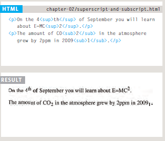
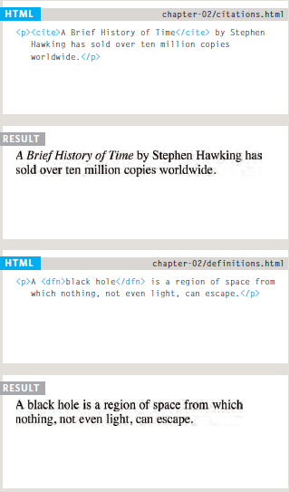

#  Basics of HTML, CSS & JS

## When creating a web page, you add tags (known as markup) to the contents of the page. These tags provide extra meaning and allow browsers to show users the appropriate structure for the page.

<br>
<br>

# Markup is divided into the two types :

* Structural Markup: what you can use
Describe each of the headings and paragraphs.

* Semantic Markup : which provides additional information; Likes
Where the focus is in the sentence, this thing
What I wrote is a quote (and whoever said it), and
Meaning of acronyms.


# Headings

### **HTML has six "levels" of headings:**
HTML defines six levels of headings. A heading element implies all the font changes, paragraph breaks before and after, and any white space necessary to render the heading. The heading elements are H1, H2, H3, H4, H5, and H6 with H1 being the highest (or most important) level and H6 the least.

```<h1> <h2> <h3> <h4> <h5> <h6>```


# Paragraphs
```<p>```

To create a paragraph, surround
the words that make up the
paragraph with an opening ```<p>```
tag and closing ```</p>``` tag.


# Bold & Italic

* Bold ```<b>```

By enclosing words in the tags
```<b>``` and ```</b>``` we can make
characters appear bold.

* Italic ```<i>```

By enclosing words in the tags
```<i>``` and ```</i>``` we can make
characters appear italic.


# Superscript & Subscript

```<sup>```

The ```<sup>``` element is used
to contain characters that
should be superscript such
as the suffixes of dates or
mathematical concepts like
raising a number to a power.

```<sub>```

The ```<sub>``` element is used to
contain characters that should
be subscript. It is commonly
used with foot notes or chemical
formulas.



# White Space
In order to make code easier to
read, web page authors often
add extra spaces or start some
elements on new lines.
When the browser comes across
two or more spaces next to each
other, it only displays one space.
Similarly if it comes across a line
break, it treats that as a single
space too. This is known as
white space collapsing.


# Line Breaks & Horizontal Rules

* Line Breaks ```<br/>```
The HTML ```<br>``` element produces a line break in text (carriage-return). It is useful for writing a poem or an address, where the division of lines is significant.

* Horizontal Rules ```<hr/>```
The HTML <hr> element represents a thematic break between paragraph-level elements: for example, a change of scene in a story, or a shift of topic within a section.


# Visual Editors & Their Code views

## 1. Visual Editors

**there are some features that are common to most editors that allow you to control the presentation of text.**

* Headings are created by
highlighting text then using
a drop-down box to select a
heading.

* Bold and italic text are
created by highlighting some
text and pressing a b or i
button.

* New paragraphs are created
using the return or the enter
key.

* Line breaks are created by
pressing the shift key and the
return key at the same time.

* Horizontal rules are created
using a button with a straight
line on it.

## 2. Code views
show you the code
created by the visual editor so
you can manually edit it, or so
you can just enter new code
yourself.


# Semantic Markup
There are some text elements that are not intended to affect the
structure of your web pages, but they do add extra information to the pages — they are known as semantic markup.

# Strong & Emphasis

* ```<strong>```

The use of the ```<strong>```
element indicates that its
content has strong importance.

* ```<em>```

The HTML ```<em>``` tag marks text that has stress emphasis which traditionally means that the text is displayed in italics by the browser. This tag is also commonly referred to as the ```<em>``` element.


# Quotations
There are two elements
commonly used for marking up
quotations:

* ```<blockquote> ```

The HTML ```<blockquote>``` Element (or HTML Block Quotation Element) indicates that the enclosed text is an extended quotation. Usually.

* ```<q>```

The ```<q>``` element is used for
shorter quotes that sit within
a paragraph. 


# ABBreviations & Acronyms

* ```<addr>```

This element only supports the global attributes. The title attribute has a specific semantic meaning when used with the ```<abbr>``` element; it must contain a full human-readable description or expansion of the abbreviation.


# Citations & Definitions

* ```<cite>```

The HTML Citation element  ```<cite>```  is used to describe a reference to a cited creative work, and must include the title of that work. The reference may be in an abbreviated form according to context-appropriate conventions related to citation metadata.

* ```<dfn>```

The HTML Definition element ```<dfn>``` is used to indicate the term being defined within the context of a definition phrase or sentence. The ```<p>``` element.



# Author Details

```<address>```

The ```<address>``` element has
quite a specific use: to contain
contact details for the author of
the page.


# Changes to Content

* ```<ins>```

The ```<ins>``` element can be used
to show content that has been
inserted into a document.

* ```<del>```

the ```<del>``` element can show text
that has been deleted from it.

* ```<s>```

The HTML ```<s>``` element renders text with a strikethrough, or a line through it. Use the ```<s>``` element to represent things that are no longer relevant or no longer accurate. However, ```<s>``` is not appropriate when indicating document edits.


# INTRODUCING CSS
CSS allows you to create rules that specify how the content of an element should appear.

## What is CSS?
* CSS stands for Cascading Style Sheets.

* CSS describes how HTML elements are to be displayed on screen, paper, or in other media.

* CSS saves a lot of work. It can control the layout of multiple web pages all at once.

* External stylesheets are stored in CSS files.

# CSS Associates Style rules with HTML elements

CSS works by associating rules with HTML elements. These rules govern
how the content of specified elements should be displayed. A CSS rule
contains two parts:

**1. selector**
Selectors indicate which
element the rule applies to.
The same rule can apply to
more than one element if you
separate the element names
with commas.

**2. declaration.**
Declarations indicate how
the elements referred to in
the selector should be styled.
Declarations are split into two
parts (a property and a value),
and are separated by a colon.


# CSS Properties Affect How Elements Are Displayed
CSS declarations sit inside curly brackets and each is made up of two parts: a **property** and a **value**, separated by a colon. You can specify
several properties in one declaration, each separated by a semi-colon.

* **property** :
Properties indicate the aspects of the element you want to change. For example, color, font, width, height and border.

* **value** : 
Values specify the settings you want to use for the chosen properties. For example, if you want to specify a color property then the value is the color you want the text in these elements to be.


# Using External CSS

```<link> ```

The <link> element can be used in an HTML document to tell the browser where to find the CSS file used to style the page. It is an empty element (meaning it does not need a closing tag), and it lives inside the <head> element. It should use three attributes:

* href
This specifies the path to the CSS file (which is often placed in a folder called css or styles).

* type
This attribute specifies the type of document being linked to. The value should be text/css.

* rel 
This specifies the relationship between the HTML page and the file it is linked to. The value should be stylesheet when linking to a CSS file.


# Using Internal CSS

```<style>```

You can also include CSS rules within an HTML page by placing them inside a ```<style>``` element, which usually sits inside the ```<head>``` element of the page. The ```<style>``` element should use the type attribute to indicate that the styles are specified in CSS. The value should be text/ css.

When building a site with more than one page, you should use
an external CSS style sheet. This:

 * Allows all pages to use the same style rules (rather than repeating them in each page).

* Keeps the content separate from how the page looks.

* Means you can change the styles used across all pages by altering just one file (rather than each individual page).

# CSS Selectors


# How CssRules Cascade

If there are two or more rules
that apply to the same element,
it is important to understand
which will take precedence.

* LAST RULE :
If the two selectors are identical, the latter of the two will take precedence. 

* SPECIFICITY :
If one selector is more specific than the others, the more specific rule will take precedence over more general ones. 

* IMPORTANT :
You can add !important after any property value to indicate that it should be considered more important than other rules that apply to the same element.


<br>


# Why use External Style Sheets?
Using External Stylesheets
The benefits of using an external style sheet are: everything is stored within a single file. once changed/updated, the changes are reflected on all other pages that reference the stylesheet. this makes it easier to maintain larger websites.


# BASIC JAVASCRIPT INSTRUCTIONS

# STATEMENTS
A script is a series of instructions that a computer can follow one-by-one.
Each individual instruction or step is known as a statement.
Statements should end with a semicolon.

* JAVASCRIPT IS CASE SENSITIVE.

* STATEMENTS ARE INSTRUCTIONS AND EACH ONE STARTS ON A NEW LINE.

* STATEMENTS CAN BE ORGANIZED INTO CODE BLOCKS

# COMMENTS

You should write **comments** to explain what your code does.They help make your code easier to read and understand.This can help you and others who read your code.

* SINGLE-LINE COMMENTS :
In a single-line comment, anything that follows the two forward slash characters( I/) on that line will not be processed by the JavaScript interpreter.

* MULTI-LINE COMMENTS
To write a comment that stretches over more than one line, you use a multi-line comment, starting with the( /* characters and ending with the * / )characters.Anything between these characters is not processed·by the JavaScript interpreter.

**Why multi-Line Comments is good?**

Multi-line comments are often used for descriptions of how the script works, or to prevent a section of the script from running when testing it.

**Good use of comments will help you if you come back to your code after several days or months. They also help those who are new to your code.**


# WHAT IS A VARIABLE?
JavaScript Variable. Variable means anything that can vary. JavaScript includes variables which hold the data value and it can be changed anytime. JavaScript uses reserved keyword **```var```** to declare a variable. ... You can assign a value to a variable using equal to (=) operator when you declare it or before using it.

**A variable is a good name for this concept because the data stored in a variable can change (or vary) each time a script runs.**

# Variable : How to declare them?
Creating a variable in JavaScript is called "declaring" a variable. You declare a JavaScript variable with the **```var```** keyword: ```var quantity;``` After the declaration, the variable has no value.


# Variable : How to assign them a value?
JavaScript uses reserved keyword ```var``` to declare a variable. A variable must have a unique name. You can assign a value to a variable using equal to (=) operator when you declare it or before using it.


# DATA TYPES

* NUMERIC DATA TYPE
The numeric data type handles
numbers.

* STRING DATA TYPE
The strings data type consists of
letters and other characters.

* BOOLEAN DATA TYPE
Boolean data types can have one
of two va lues: true or false.


# RULES FOR NAMING VARIABLES

1. The name must begin with
a letter, dollar sign ($),or an
underscore (_). It must not start
with a number.

2. The name can contain letters,
numbers, dollar sign ($), or an
underscore (_). Note that you
must not use a dash(-) or a
period (.) in a variable name.

3. You cannot use keywords or
reserved words. Keywords
are special words that tell the
interpreter to do something.

4. All variables are case sensitive,
so score and Score would be
different variable names, but
it is bad practice to create two
variables that have the same
name using different cases.

5. Use a name that describes the
kind of information that the
variable stores.

6. If your variable name is made
up of more than one word, use a
capital letter for the first letter of
every word after the first word.

# ARRAYS
An array is a special type of variable. It doesn't
just store one value; it stores a list of values.

You should consider using an
array whenever you are working
with a list or a set of values that
are related to each other.

# Create an Array 
The Array() constructor is used to create Array objects.

### **Syntax**

```[element0, element1, ..., elementN]```

```new Array(element0, element1[, ...[, elementN]])```
```new Array(arrayLength)```

### **Parameters**

1. elementN

A JavaScript array is initialized with the given elements, except in the case where a single argument is passed to the Array constructor and that argument is a number.

2. arrayLength

If the only argument passed to the Array constructor is an integer between 0 and 232-1 (inclusive), this returns a new JavaScript array with its length property set to that number. If the argument is any other number, a RangeError exception is thrown.

# EXPRESSIONS
An expression evaluates into (results in) a single value. Broadly speaking
there are two types of expressions:

* EXPRESSIONS THAT JUST ASSIGN A
VALUE TO A VARIABLE :
In order for a variable to be useful, it needs to be given a value. 

* EXPRESSIONS THAT USE TWO OR
MORE VALUES TO RETURN A
SINGLE VALUE :
You can perform operations on any number of
individual values.

# OPERATORS

Expressions rely on things called operators; they allow programmers to create a single value from one or more values.

* ARITHMETIC OPERATORS

JavaScript contains the following mathematical
operators, which you can use with numbers.
You may remember some from math class.


###  USING ARITHMETIC OPERATORS

Example of the arithmetic operators :


# STRING OPERATOR

There is just one string operator: the **+** symbol.
It is used to join the strings on either side of it.

### USING STRING OPERATORS

Example of the string operators :


<br>


 # Comparison operators
 operators that compare values and return true or false. The operators include:
 ( >, <, >=, <=, ===, and !==).

# Logical operators
 operators that combine multiple boolean expressions or values and provide a single boolean output. The operators include: (&&, ||, and !).

## Comparison Operators

You may be familiar with comparison operators from math class. Let’s make sure there aren’t any gaps in your knowledge.

* Less than (<) — returns true if the value on the left is less than the value on the right, otherwise it returns false.

* Greater than (>) — returns true if the value on the left is greater than the value on the right, otherwise it returns false.

* Less than or equal to (<=) — returns true if the value on the left is less than or equal to the value on the right, otherwise it returns false.

* Greater than or equal to (>=) — returns true if the value on the left is greater than or equal to the value on the right, otherwise it returns false.

* Equal to (===) — returns true if the value on the left is equal to the value on the right, otherwise it returns false.

* Not equal to (!==) — returns true if the value on the left is not equal to the value on the right, otherwise it returns false.

## Logical Operators
Comparison operators allow us to assert the equality of a statement with JavaScript.

There are scenarios, however, in which we must assert whether multiple values or expressions are true. In JavaScript, we can use logical operators to make these assertions.

* AND (&&) 
 This operator will be truthy (act like true) if and only if the expressions on both sides of it are true.

* OR(||) 
 This operator will be truthy if the expression on either side of it is true. Otherwise, it will be falsy (act like false).

```<script>```

```var color ="red";```

```if(5>=5 && color==='red' )```

```</script>```

The && operator requires that both expressions be true in order for the expression to be truthy. Because one expression is false and the other is true, the expression is falsy and evaluates to false.


