# HTML Lists, Control Flow with JS, and the CSS Box Model

<br>

# Lists
lists allow web developers to group a set of related items in lists.

There are lots of occasions when we
need to use lists. HTML provides us with
three different types:

* Ordered lists are lists where each item in the list is numbered.

* Unordered lists are lists that begin with a bullet point.

* Definition lists are made up of a set of terms along with the definitions for each of those terms.

# Ordered Lists
The ordered list is created with
the ```<ol>``` element.```<li>```
Each item in the list is placed
between an opening ```<li>``` tag
and a closing ```</li>``` tag.

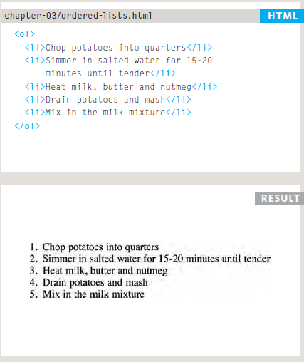

# Unordered Lists
The unordered list is created
with the ```<ul>``` element.```<li>```Each item in the list is placed between an opening ```<li>``` tag and a closing ```</li>``` tag.

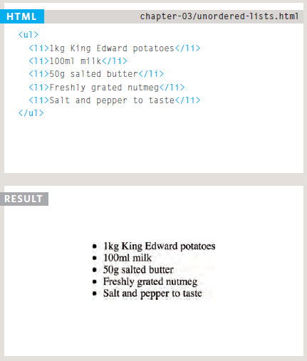

# Definition Lists
The definition list is created with the ```<dl>``` element and usually consists of a series of terms and their definitions.Inside the ```<dl>``` element you will usually see pairs of ```<dt>``` and ```<dd>``` elements.```<dt>```
This is used to contain the term being defined (the definition term).```<dd>```
This is used to contain the definition.

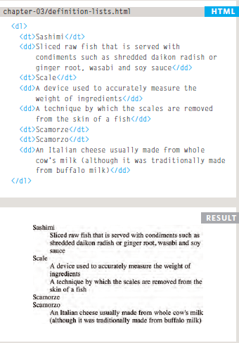

# Nested Lists
You can put a second list inside
an ```<li>``` element to create a sublist
or nested list.

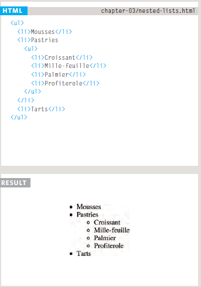

<br>

# Boxes
All HTML elements can be considered as boxes. In CSS, the term "box model" is used when talking about design and layout.
The CSS box model is essentially a box that wraps around every HTML element. It consists of: margins, borders, padding, and the actual content.

# Box DIMENSIONS width, height
By default in the CSS box model, the width and height you assign to an element is applied only to the element's content box. If the element has any border or padding, this is then added to the width and height to arrive at the size of the box that's rendered on the screen.

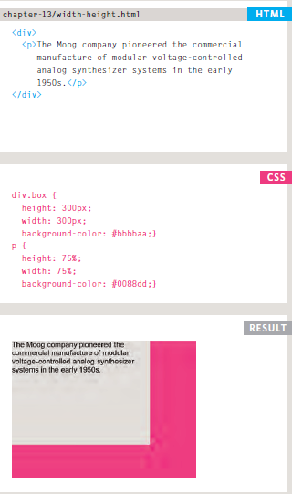

# Limiting Width min-width, max-width

* Min-Width

The **min-width** property defines the minimum width of an element.
If the content is smaller than the minimum width, the minimum width will be applied.If the content is larger than the minimum width, the min-width property has no effect.

* Max-Width

The **max-width** property defines the maximum width of an element.If the content is larger than the maximum width, it will automatically change the height of the element.If the content is smaller than the maximum width, the max-width property has no effect.

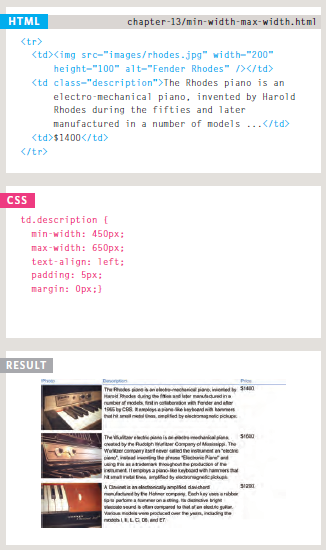

# Limiting Height min-height, max-height

* Min-Heghit

The **min-height** property defines the minimum height of an element.If the content is smaller than the minimum height, the minimum height will be applied.If the content is larger than the minimum height, the min-height property has no effect.

* Max-Height

The **max-height** property defines the maximum height of an element.If the content is larger than the maximum height, it will overflow. How the container will handle the overflowing content is defined by the overflow property.If the content is smaller than the maximum height, the max-height property has no effect.

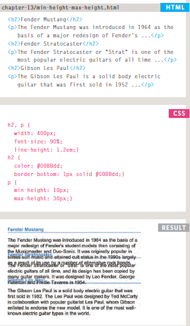

# Overflowing Content 

**overflow**
The overflow property tells the
browser what to do if the content
contained within a box is larger
than the box itself. It can have
one of two values:

* hidden-This property simply hides any
extra content that does not fit in
the box.

* scroll-This property adds a scrollbar to
the box so that users can scroll
to see the missing content.

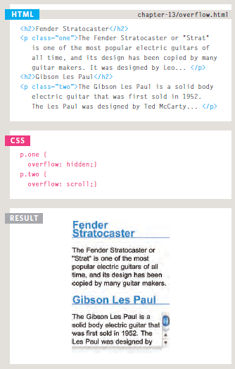

# Border, Margin & Padding

* Border-Every box has a border (even if
it is not visible or is specified to
be 0 pixels wide). The border
separates the edge of one box
from another.

* Margin-Margins sit outside the edge
of the border. You can set the
width of a margin to create a
gap between the borders of two
adjacent boxes.

* Padding-Padding is the space between
the border of a box and any content contained within it.Adding padding can increase the
readability of its contents.


# White space & Vertical Margin
The padding and margin properties are very helpful
in adding space between various items on the page.

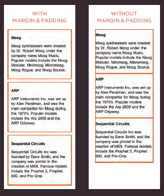

# Border Width (border-width)
The border-width property
is used to control the width
of a border. The value of this
property can either be given
in pixels or using one of the
following values:

* thin 
* medium 
* thick

You can control the individual
size of borders using four
separate properties:

* border-top-width
* border-right-width
* border-bottom-width
* border-left-width

You can also specify different
widths for the four border values
in one property,such as :

```border-width: 2px 1px 1px 2px;```

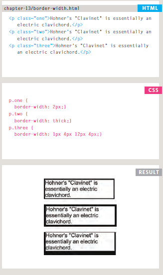

# Border Style (border-style)

You can control the style of a
border using the border-style
property. This property can take
the following values:

* solid a single solid line.
* dotted a series of square dots.
* dashed a series of short lines.
* double two solid lines.
* groove appears to be carved
into the page.
* ridge appears to stick out from
the page.
* inset appears embedded into
the page.
* outset looks like it is coming
out of the screen.
* hidden / none no border is
shown.

You can individually change the
styles of different borders using:

* border-top-style
* border-left-style
* border-right-style
* border-bottom-style

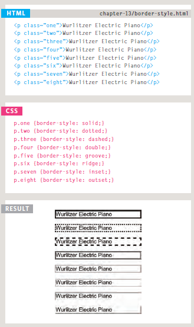

# Border Color (border-color)
You can specify the color of a
border using either RGB values,
hex codes or CSS color names.

It is possible to individually
control the colors of the borders
on different sides of a box using:

* border-top-color
* border-right-color
* border-bottom-color
* border-left-color

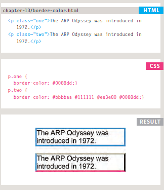

# Shorthand border
The border property allows you
to specify the width, style and
color of a border in one property.

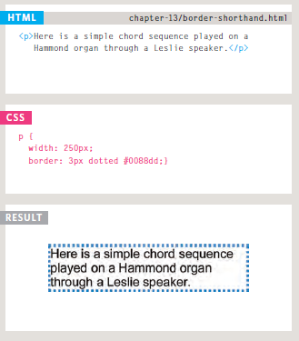

# PADDING
The padding property allows
you to specify how much space
should appear between the
content of an element and its
border.You can specify different values
for each side of a box using:
* padding-top
* padding-right
* padding-bottom
* padding-left

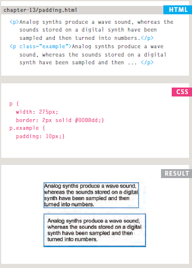

# MARGIN
The margin property controls the gap between boxes. Its value is commonly given in pixels,
although you may also use percentages or ems.
You can specify values for each
side of a box using:
* margin-top
* margin-right
* margin-bottom
* margin-left

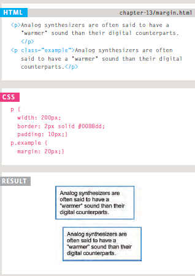

# CHANGE Inline/Block (display)
The display property allows
you to turn an inline element
into a block-level element or vice
versa, and can also be used to
hide an element from the page.

The values this property can
take are:

* inline-This causes a block-level
element to act like an inline
element.
* block-This causes an inline element to
act like a block-level element.
* inline-block-This causes a block-level
element to flow like an inline
element, while retaining other
features of a block-level element.
* none-This hides an element from the page. In this case, the element acts as though it is not on the page at all.

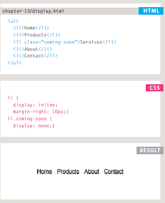


# Hiding Boxes (visibility)
The visibility property allows
you to hide boxes from users
but It leaves a space where the
element would have been.
This property can take two
values:

* hidden-This hides the element.
* visible-This shows the element.

If the visibility of an element
is set to hidden, a blank space
will appear in its place.
If you do not want a blank space
to appear, then you should use
the display property with
a value of none instead.

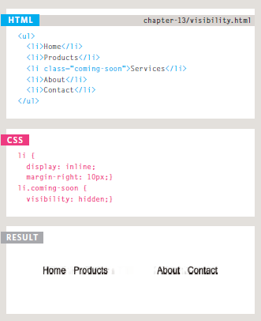

# CSS3: BORDER IMAGES (border-image)
The border-image property
applies an image to the border of
any box. It takes a background
image and slices it into nine
pieces.

This property requires three
pieces of information:

1. The URL of the image
2. Where to slice the image
3. What to do with the straight
edges; the possible values are:
**stretch** stretches the image
**repeat** repeats the image
**round** like repeat but if the
tiles do not fit exactly, scales
the tile image.

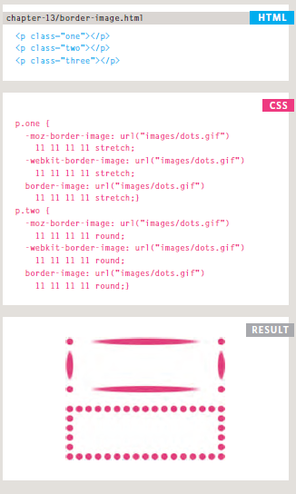

# CSS3: BOX SHADOWS (box-shadow)
The box-shadow property allows you to add a drop shadow around a box .It must use at least the first of these two values as well as a color:

* Horizontal offset-Negative values position the
shadow to the left of the box.
* Vertical offset-Negative values position the
shadow to the top of the box.
* Blur distance-If omitted, the shadow is a solid
line like a border.
* Spread of shadow-If used, a positive value will
cause the shadow to expand in
all directions, and a negative
value will make it contract.

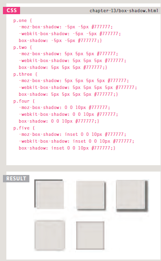

<br>

# SWITCH STATEMENTS
The switch statement is used to perform different actions based on different conditions.
The JavaScript Switch Statement
Use the switch statement to select one of many code blocks to be executed.

* The switch expression is evaluated once.
* The value of the expression is compared with the values of each case.
* If there is a match, the associated block of code is executed.
* If there is no match, the default code block is executed.

**The break Keyword**
When JavaScript reaches a break keyword, it breaks out of the switch block.This will stop the execution inside the switch block .It is not necessary to break the last case in a switch block.The block breaks (ends) there anyway.


**The default Keyword**
The default keyword specifies the code to run if there is no case match.

If multiple cases matches a case value, the first case is selected.If no matching cases are found, the program continues to the default label.
If no default label is found, the program continues to the statement(s) after the switch.

**Strict Comparison**
Switch cases use strict comparison (===).
The values must be of the same type to match.
A strict comparison can only be true if the operands are of the same type.

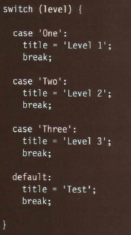

# TYPE COERCION & WEAK TYPING
JavaScript can convert data
types behind the scenes to
complete an operation. This is
known as type coercion.

JavaScript is said to use weak typing because the data type for a value can change. Some other languages require that you specify what data type each variable will be. They are said to use strong typing.

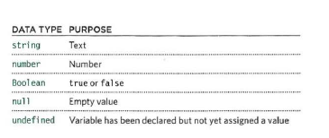

# TRUTHY & FALSY VALUES

Due to type coercion, every value in JavaScript
can be treated as if it were true or false.

* Falsy Value-Falsy values are treated as if they are false.Falsy values can also be treated as the number 0 .

* Truthy Value-Truthy values are treated as if they are true. Truthy values can also be treated as the number 1.

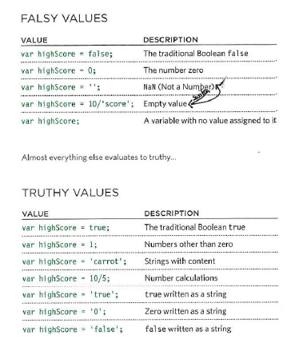

<br>


# Loops

## For Loop
A **for** loop declares looping instructions, with three important pieces of information separated by semicolons ```;```:

* The initialization defines where to begin the loop by declaring (or referencing) the iterator variable.

* The stopping condition determines when to stop looping (when the expression evaluates to false).

* The iteration statement updates the iterator each time the loop is completed.

```<script>```

```for(var i=0;i< 20 ;i++){```

 ```consol.log(i);```

```}```

## While Loop

The **while** loop creates a loop that is executed as long as a specified condition evaluates to **true**. The loop will continue to run until the condition evaluates to **false**. The condition is specified before the loop, and usually, some variable is incremented or altered in the **while** loop body to determine when the loop should stop.

```<script>```

```var sum=0;```

```var i=0;```

```while(i>20){```

```sum+=i;```

```}```

```</script>```

## DO WHILE LOOPS
The do/while statement creates a loop that executes a block of code once, before checking if the condition is **true**, then it will **repeat the loop as long as the condition is true**.
The do/while statement is used when you want to run a loop at least one time, no matter what.

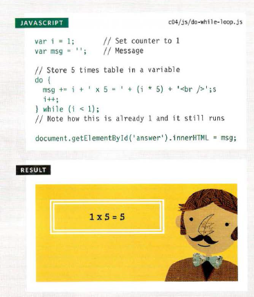


