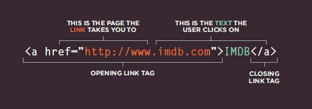
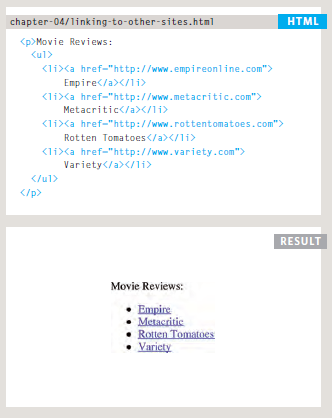
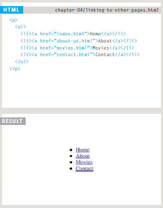
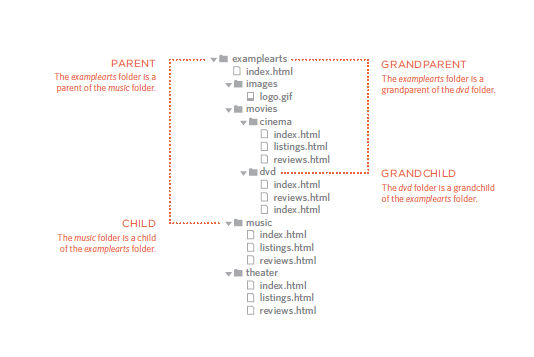
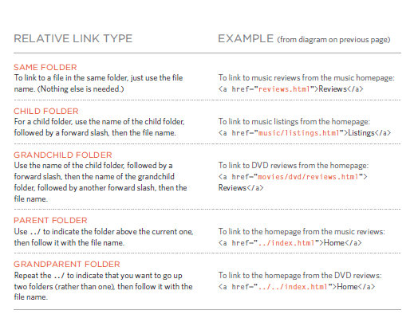
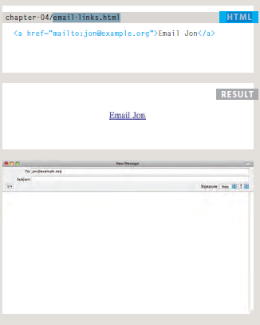
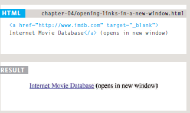
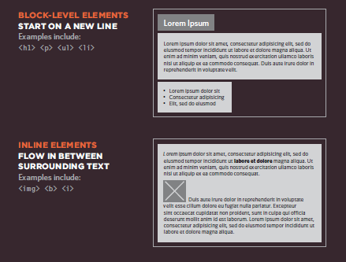
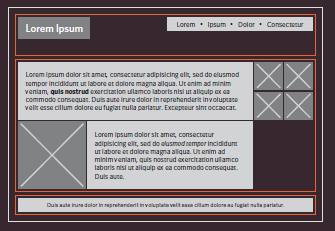
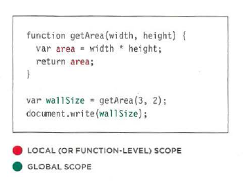

# HTML Links, JS Functions, and Intro to CSS Layout

# Links
Links are the defining feature of the web
because they allow you to move from
one web page to another — enabling the
very idea of browsing or surfing.

## Writing Links
Links are created using the ```<a>``` element. Users can click on anything
between the opening ```<a>``` tag and the closing ```</a>``` tag. You specify
which page you want to link to using the href attribute.



The text between the opening
```<a>``` tag and closing ```</a>``` tag
is known as link text. Where
possible, your link text should
explain where visitors will be
taken if they click on it.

## Linking to Other Sites

1. Links are created using the ```<a>``` element which has an attribute
called href. The value of the href attribute is the page that
you want people to go to when they click on the link.

2. Users can click on anything that appears between the opening
```<a>``` tag and the closing ```</a>``` tag and will be taken to the page
specified in the href attribute.



## Linking to Other Pages on the Same Site
When you are linking to other
pages within the same site,
you do not need to specify the
domain name in the URL. You
can use a shorthand known as a
relative URL.



# Directory Structure
‬‏A well-designed folder structure will help you quickly navigate to the HTML or CSS files that contain your code. First, open Finder (in Mac) or Explorer (in Windows). Next, create a folder (also known as a directory) called DevProject. This folder will contain all of the files for your HTML and CSS project.



# Rela tive URLs
Relative URLs can be used when linking to pages within your own
website. They provide a shorthand way of telling the browser where to
find your files.



# Email Links

**mailto:** 
To create a link that starts up
the user's email program and
addresses an email to a specified
email address, you use the ```<a>```
element. However, this time the
value of the href attribute starts
with mailto: and is followed by
the email address you want the
email to be sent to.



# Opening Links in a New Window
**target**:If you want a link to open in a
new window, you can use the
target attribute on the opening
```<a>``` tag. The value of this
attribute should be _blank.



<br>

<br>


# Layout
CSS page layout techniques allow us to take elements contained in a web page and control where they are positioned relative to their default position in normal layout flow, the other elements around them, their parent container, or the main viewport/window. 

* Building Blocks

CSS treats each HTML element as if it is in its
own box. This box will either be a block-level
box or an inline box.



* Containing Elements

If one block-level element sits inside another
block-level element then the outer box is
known as the containing or parent element.



# Controlling the Position of Elements
CSS has the following **positioning schemes** that allow you to control the layout of a page:
 * normal flow.
 * relative positioning.
 * absolute positioning.
 
  You specify the positioning scheme using the positionproperty in CSS. You can also float elements using the float property.

To indicate where a box should be positioned, you may also need to use box offset properties to tell the browser how far from the top or bottom
and left or right it should be placed.


## WHAT IS A FUNCTION?

Functions are one of the fundamental building blocks in JavaScript. A function is a reusable set of statements to perform a task or calculate a value. Functions can be passed one or more values and can return a value at the end of their execution. In order to use a function, you must define it somewhere in the scope where you wish to call it.

## A BASIC FUNCTION


# Declaring A Function
To create a function you need to give it a name then write the statement that achieve the task you want to make it


# Calling A Function
When you finished from writing the statement of the function you can run with just one line of the code.


# Declaring Function that need information
There are functions in order to work the task that build for it they need some information.


# VARIABLE SCOPE
The location where you declare a variable will affect where it can be used
within your code. If you declare it within a function, it can only be used
within that function. This is known as the variable's scope.

* **LOCAL VARIABLES**
When a variable is created inside a function using the var keyword, it can only be used in that function .It is called a local variable or function-level variable .It is said to have local scope or function-level scope .It cannot be accessed outside of the function in
which it was declared.

* **GLOBAL VARIABLES**
If you create a variable outside of a function, then it can be used anywhere within the script. It is called a global variable and has global scope. Global variables are stored in memory for as long as the web page is loaded into the web browser.This means they take up more memory than local.




  


