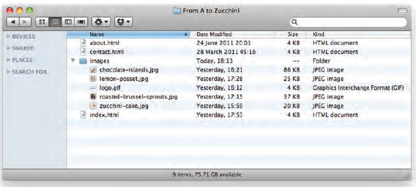
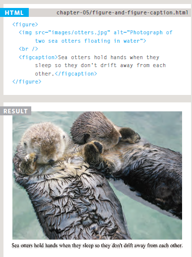

# Images, Color, Text

## There are many reasons why you might want to add an image to a web page: you might want to include a logo, photograph, illustration, diagram, or chart.
<br>

# Choosing Images for Your Site

A picture can say a thousand words, and great
images help make the difference between an
average-looking site and a really engaging one.

Images can be used to set a file Tone to site in less time than Take a reading of the description.

# Images should:
* Be relevant.
* Convey information.
* Convey the right mood.
* Be instantly recognisable.
* Fit the color palette.

# Storing Images on Your Site

If you are building a site from scratch, it is good practice to create a folder for all of the images the site uses.

As a website grows, keeping images in a separate folder helps you understand how the site is organized. Here you can see an example of the files for a website; all of the images are stored in a folder called images.

On a big site you might like to add subfolders inside the images folder. For example, images such as logos and buttons might sit in a folder called interface, product photographs might sit in a page called products, and images related to news might live in a folder called news.



# Adding Images
``````
To add an image into the page you need to use an ``````
element. This is an empty element (which means there is
no closing tag). It must carry the following two attributes:
**src** This tells the browser where it can find the image file. This will usually be a relative **URL** pointing to an image on your own site.**alt** This provides a text description of the image which describes the image if you cannot see it.**title** You can also use the title attribute with the `````` element to provide additional information about the image. Most browsers will display the content of this attribute in a tootip when the user hovers over the image.


# height & width of Images:
1. Where to place Images In Your Code:
* before a paragraph.
* InsIde the start of a paragraph.
* In the mIddle of a paragraph.

2. Where you place the image in
the code:
* Block elements always appear
on a new line.
* Inline elements sit within a
block level element and do not
start on a new line.


# aligning Images horizontally:
align: The align attribute was commonly used to indicate how the other parts of a page should flow around an image. It has been removed from HTML5 and new websites should use CSS to control the alignment of images.

The align attribute can take these horizontal values:
* left
* right
* top
* middle
* bottom

# three rules for CreatIng Images:
save Images In the rIght format
saVe Images at the rIght size
use the CorreCt resolutIon
Image formats:
* Jpeg
* gIf
* png

# CroppIng Images:
When cropping images it is important not to lose valuable information. It is best to source images that are the correct shape if possible.
* portraIt
* landsCape

animated gifs:
Animated GIFs show several frames of an image in sequence and therefore can be used to create simple animations.

# figure & figure Caption:
* ```<figure>``` element to
contain images and their caption
so that the two are associated.
You can have more than one
image inside the ```<figure>```
element as long as they all share
the same caption.

* The ```<figcaption>``` element has
been added to HTML5 in order
to allow web page authors to add
a caption to an image.
Before these elements were
created there was no way to
associate an `````` element with
its caption.



# Color

## Introduction to Color
CSS supports a wide variety of colors. These include named colors, like blue, black, and LimeGreen, along with colors described by a numeric value. Using a numeric system allows us to take advantage of the whole spectrum of colors that browsers support.


## Foreground Color color
The color property allows you
to specify the color of text inside
an element.

**Colors in CSS can be described in three different ways:**

* Named colors : English words that describe colors, also called keyword colors.

* RGB : numeric values that describe a mix of red, green, and blue.

* HSL : numeric values that describe a mix of hue, saturation, and lightness.


## Understanding Color
Every color on a computer screen is created by mixing amounts of red,
green, and blue. To find the color you want, you can use a color picker.

* **RGB Values**
Values for red, green, and blue
are expressed as numbers
between 0 and 255.

* **Hex Codes**
Hex values represent values
for red, green, and blue in
hexadecimal code.

* **Color Names**
Colors are represented by
predefined names. However,
they are very limited in number.

* **Hue**
Hue is near to the colloquial idea
of color. Technically speaking
however, a color can also have
saturation and brightness as
well as hue.

* **Saturation**
Saturation refers to the amount
of gray in a color. At maximum
saturation, there would be no
gray in the color. At minimum
saturation, the color would be
mostly gray.

* **Brightness**
Brightness (or "value") refers
to how much black is in a color.
At maximum brightness, there
would be no black in the color.
At minimum brightness, the
color would be very dark.

# Contrast
When picking foreground and background
colors, it is important to ensure that there is
enough contrast for the text to be legible.

* **Low Contrast**
1. Text is harder to read when
there is low contrast between
background and foreground
colors.

2. A lack of contrast is particularly
a problem for those with
visual impairments and color
blindness.

3. It also affects those with poor
monitors and sunlight on their
screens 

* **High Contrast**
Text is easier to read when
there is higher contrast between
background and foreground
colors.

* **Medium Contrast**
For long spans of text, reducing the contrast a little bit improves readability.

## Opacity and Alpha

To use opacity in the HSL color scheme, use hsla instead of hsl, and four values instead of three. For example:

```color: hsla(34, 100%, 50%, 0.1);```

The first three values work the same as hsl. The fourth value (which we have not seen before) is the alpha. This last value is sometimes called the opacity.

Alpha is a decimal number from zero to one. If alpha is zero, the color will be completely transparent. If alpha is one, the color will be opaque. The value for half transparent would be 0.5.


The RGB color scheme has a similar syntax for opacity, rgba. Again, the first three values work the same as rgb and the last value is the alpha. Here’s an example:

```color: rgba(234, 45, 98, 0.33);```

Alpha can only be used with HSL and RGB colors; we cannot add the alpha value to color: green color: #FFFFF.

There is, however, a named color keyword for zero opacity, transparent. It’s equivalent to rgba(0, 0, 0, 0). It’s used like any other color keyword:

```color: transparent;```

# HSL
One syntax that we can use to specify colors is called hexadecimal. Colors specified using this system are called hex colors. A hex color begins with a hash character (#) which is followed by three or six characters. The characters represent values for red, blue and green.

```DarkSeaGreen: #8FBC8F```

```Sienna:       #A0522D```

```SaddleBrown:  #8B4513```

```Brown:        #A52A2A```

```Black:        #000000 or #000```

```White:        #FFFFFF or #FFF```

```Aqua:         #00FFFF or #0FF```

You can include hex colors just as you would include named colors: 
```background-color: #9932cc;.```.

#  HSL & HSLA

* **hue**
This is expressed as an angle
(between 0 and 360 degrees).

* **saturation**
This is expressed as a
percentage.

* **lightness**
This is expressed as a
percentage with 0% being white,
50% being normal, and 100%
being black.

The hsla color property allows you to specify color properties using hue, saturation, and lightness , and adds a fourth value which represents transparency.

* **alpha**
This is expressed as a number between 0 and 1.0.
For example, 0.5 represents 50% transparency, and 0.75 represents 75% transparency.

# Text 
The properties that allow you to control
the appearance of text can be split into
two groups:

* Those that directly affect the font and its appearance
(including the typeface, whether it is regular, bold or italic,
and the size of the text).

* Those that would have the same effect on text no matter
what font you were using (including the color of text and
the spacing between words and letters).


# Choosing a Typeface for your Website
When choosing a typeface, it is important to understand that a
browser will usually only display it if it's installed on that
user's computer.


# Techniques That Offer a Wider Choice of Typefaces

* font-family 
* font-face Service-based
* Font-Face

# Specifying Typefaces(font-family)
The font-family property
allows you to specify the
typeface that should be used for
any text inside the element(s) to
which a CSS rule applies.


# Size of Type(font-size)
The font-size property enables
you to specify a size for the
font. There are several ways to
specify the size of a font.

most common are:
* pixels
* percentages
* ems


# Type Scales
You may have noticed that programs such as
Word, Photoshop and InDesign offer the same
sizes of text.


