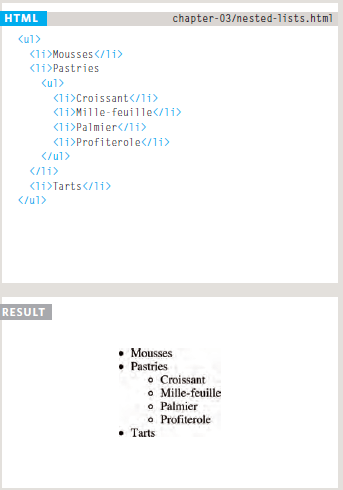

# Layout
CSS page layout techniques allow us to take elements contained in a web page and control where they are positioned relative to their default position in normal layout flow, the other elements around them, their parent container, or the main viewport/window. 

* Building Blocks

CSS treats each HTML element as if it is in its
own box. This box will either be a block-level
box or an inline box.


* Containing Elements

If one block-level element sits inside another
block-level element then the outer box is
known as the containing or parent element.


# Controlling the Position of Elements
CSS has the following **positioning schemes** that allow you to control the layout of a page:
 * normal flow.
 * relative positioning.
 * absolute positioning.
 
  You specify the positioning scheme using the positionproperty in CSS. You can also float elements using the float property.

To indicate where a box should be positioned, you may also need to use box offset properties to tell the browser how far from the top or bottom
and left or right it should be placed.


## Fixed Positioning

* This is a form of absolute positioning that positions the element in relation to the browser window, as opposed to the containing element.

* Elements with fixed positioning do not affect the position of surrounding elements and they do not move when the user
scrolls up or down the page.

## floating elements
The float CSS property places an element on the left or right side of its container, allowing text and inline elements to wrap around it. The element is removed from the normal flow of the page, though still remaining a part of the flow (in contrast to absolute positioning).


# Normal Flow(position:static)

* In normal flow, each block-level
element sits on top of the next
one.  Since this is the default
way in which browsers treat
HTML elements.
*  you do not need a CSS property to indicate
that elements should appear in normal flow.


the syntax :
```position: static;```


# Relative Positioning(position:relative)
Relative positioning moves an
element in relation to where it
would have been in normal flow.

to control in relative position 
1. properties (top or bottom and
left or right).
2. To move the box up or down,you can use either the top or
bottom properties.


# Absolute Positioning(position:absolute)


# Fixed Positioning(position:fixed)

Fixed positioning is a type
of absolute positioning that
requires the position property
to have a value of fixed.

To control where the fixed
position box appears in relation
to the browser window, the box
offset properties are used.


# Floating Elements(float)
The float property allows you
to take an element in normal
flow and place it as far to the
left or right of the containing
element as possible.


# Clearing Floats(clear)
The clear property allows you
to say that no element (within
the same containing element)
should touch the left or righthand
sides of a box.

**It can take the following values:**

* left
* right
* both
* non


# Fixed Width Layouts


# Liquid Layouts




