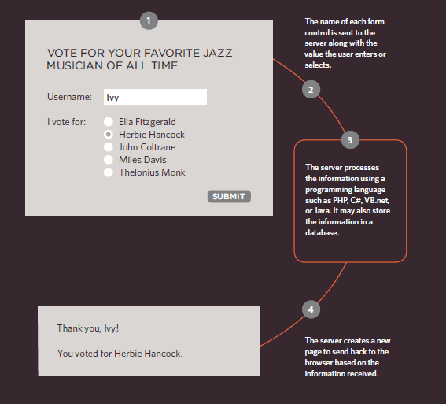
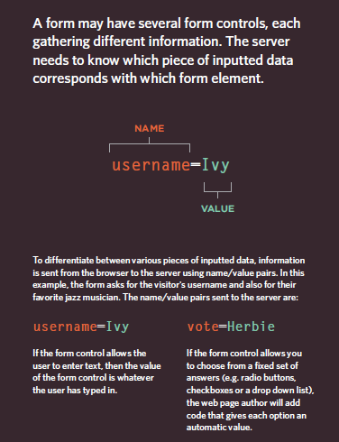
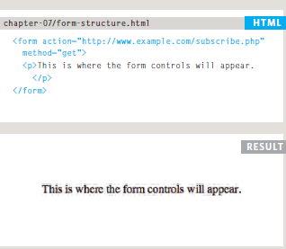
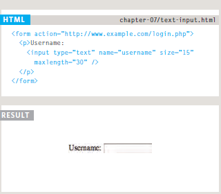
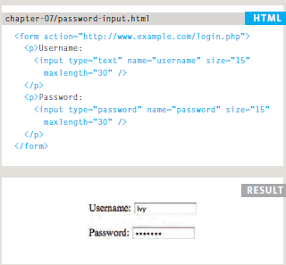

# Why Forms?
The best known form on the web is probably the search box that sits right in the middle of Google's homepage.

# Form Controls:
There are several types of form controls that you can use to collect information from visitors to your site:

1. Adding text:
* Text Input
* Password input
* Text area
2. making choices:
* Radio buttons
* Checkboxes
* Drop-down boxes
3. submitting Forms:
* Submit buttons
* Image buttons
4. uploading files:
* File upload


# How Forms Work






# Form Structure

1. ```<form>```Form controls live inside a ```<form>``` element. This element should always carry the action attribute and will usually have a method and id attribute too.

2. action-Every ```<form>``` element requires an action attribute. Its value is the URL for the page on the server that will receive the information in the form when it is submitted.

3. method-Forms can be sent using one of two methods: get or post.



# Text Input

1. The ```<input>``` element is used to create several different form controls.

2. type="text"-When the type attribute has a value of text, it creates a singleline text input.

3. name

4. maxlength
5. Size



# Password Input
**type="password**- When the type attribute has a value of password it creates a text box that acts just like a single-line text input, except the characters are blocked out.




# Text Area
The ```<textarea>``` element
is used to create a mutli-line
text input. Unlike other input
elements this is not an empty
element. It should therefore have
an opening and a closing tag.

# Radio Button
* type="radio"
Radio buttons allow users to pick
just one of a number of options.

* name
* value
* checked

# Drop Down List Box

* The ```<select>``` element is used
to create a drop down list box. It
contains two or more ```<option>```
elements.
* The ```<option>``` element is used
to specify the options that the
user can select from. The words
between the opening ```<option>```
and closing ```</option>``` tags will
be shown to the user in the drop
down box.

* selected
The selected attribute can be
used to indicate the option that
should be selected when the
page loads.


<br>

## width:
to set the width of the table

## padding:
to set the space between the border of each table cell and its content

## text-transform
to convert the content of the table headers to uppercase

## letter-spacing, font-size
to add additional styling to the content of the table headers

## border-top, border-bottom
to set borders above and below the table headers

## text-align
to align the writing to the left of some table cells and to the right of the others

## background-color
to change the background color of the alternating table rows

## hover
to highlight a table row when a user’s mouse goes over it

# Border on Empty Cells(empty-cells)
show This shows the borders of any empty cells.

hide This hides the borders of any empty cells.

inherit If you have one table nested inside another, the inherit value instructs the table cells to obey the rules of the containing table.

# Events
Events are the browser’s way of indicating when something has happened (such as when a page has finished loading or a button has been clicked).

The load event is commonly used to trigger scripts that access the contents of the page.


