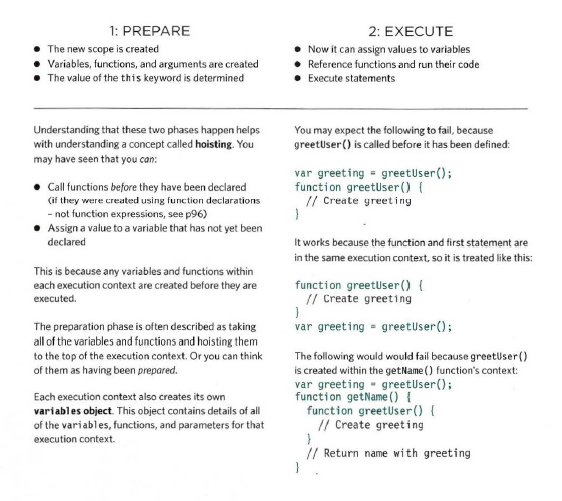
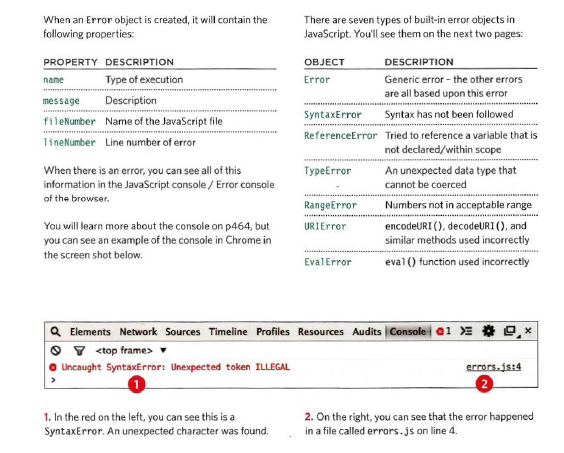
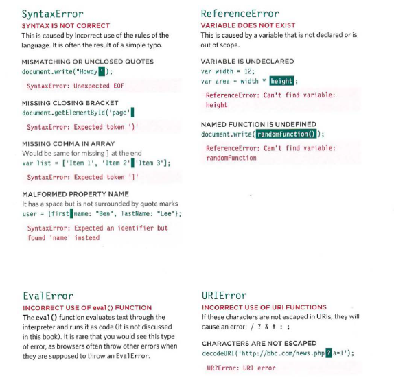
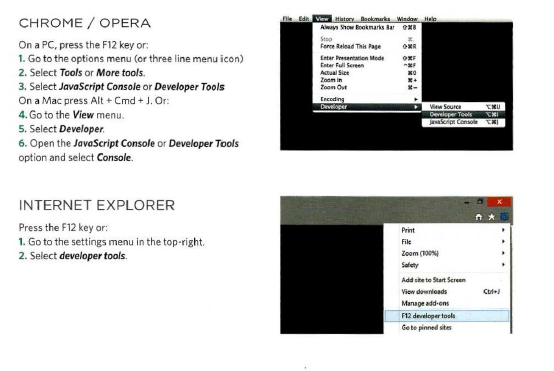
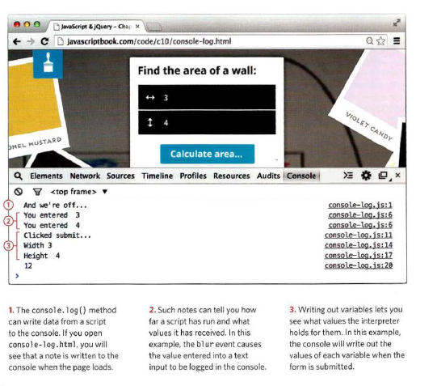

# Error Handling & Debugging
JavaScript can be hard to learn and everyone makes
mistakes when writing it.
When you are writing JavaScript, do not expect to write it perfectly the first time.
Programming is like problem solving: you are given a puzzle and not only do you have to solve
it, but you also need to create the instructions that allow the computer to solve it. too.
When writing a long script, nobody gets everything right in their first attempt. The error
messages that a browser gives look cryptic at first, but they can help you determine what
went wrong in your JavaScript and how to fix it.


**so** 
How we can find the errors in our code?
How to write scripts that deal with potential errors gracefully?

* Console & DEV Tools
* COMMON PROBLEMS
* HANDLING ERRORS

# ORDER OF EXECUTION
To find the source of an error, it helps to know how scripts are processed.
# EXECUTION CONTEXTS
The JavaScript interpreter uses the concept of execution contexts.
There is one global execution context; plus, each function creates a new
new execution context. They correspond to variable scope.

Every statement in a script lives in one of three
execution contexts:
* GLOBAL CONTEXT
Code that is in the script, but not in a function.
There is only one global context in any page.

* FUNCTION CONTEXT
Code that is being run within a function.
Each function has its own function context.

* EVAL CONTEXT (NOT SHOWN)
Text is executed like code in an internal function
called ```eva l ()```.

# VARIABLE SCOPE
The first two execution contexts correspond with the
notion of scope

* GLOBAL SCOPE
If a variable is declared outside a function, it can
be used anywhere because it has global scope.
If you do not use the var keyword when creating

* FUNCTION-LEVEL SCOPE
When a variable is declared within a function,
it can only be used within that function. This is
because it has function-level scope.

# EXECUTION CONTEXT & HOISTING
Each time a script enters a new execution context, there are two phases of activity:



# ERROR OBJECTS
Error objects can help you find where your mistakes are
and browsers have tools to help you read them.





# HOW TO DEAL WITH ERRORS

1. DEBUG THE SCRIPT TO FIX ERRORS
2. HANDLE ERRORS GRACEFULLY


# A DEBUGGING WORKFLOW
Debugging is about deduction: eliminating potential causes of an error.

* **WHERE IS THE PROBLEM?**

First, should try to can narrow down the area where
the problem seems to be. In a long script, this is
especially important.

1. Look at the error message, it tells you:

* The relevant script that caused the problem.
* The line number where it became a problem for
the interpreter. (As you will see, the cause of
the error may be earlier in a script; but this is the
point at which the script could not continue.)
* The type of error (although the underlying cause
of the error may be different).

2. Check how far the script is running.
Use tools to write messages to the console to tell
how far your script has executed.

* **WHAT EXACTLY IS THE PROBLEM?**

Once you think that you might know the rough area
in which your problem is located, you can then try to
find the actual line of code that is causing the error.

1. When you have set breakpoints, you can see if the
variables around them have the values you would
expect them to. If not, look earlier in the script.

2. Break down I break out parts of the code to test
smaller pieces of the functionality.
* Write values of variables into the console.
* Calrfunctions from the console to check if they
are returning what you would expect them to.
* Check if objects exist and have the methods I
properties that you think they do.

3. Check the number of parameters for a function, or
the number of items in an array.

# BROWSER DEV TOOLS & JAVASCRIPT CONSOLE
The JavaScript console will tell you when there is a problem with a script,
where to look for the problem, and what kind of issue it seems to be.



# WRITING FROM THE SCRIPT TO THE CONSOLE
Browsers that have a console have a console object, which has several
methods that your script can use to display data in the console.
The object is documented in the Console API.



