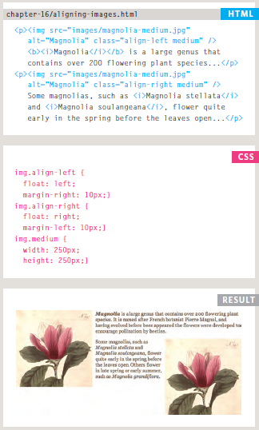
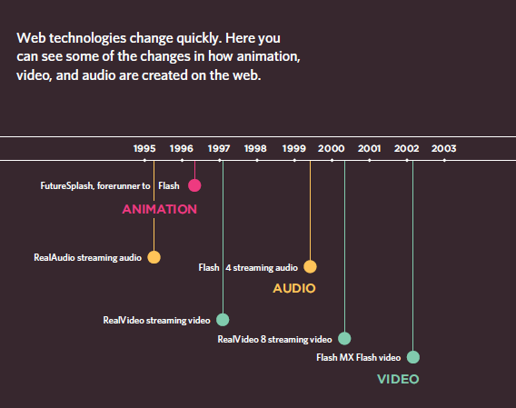
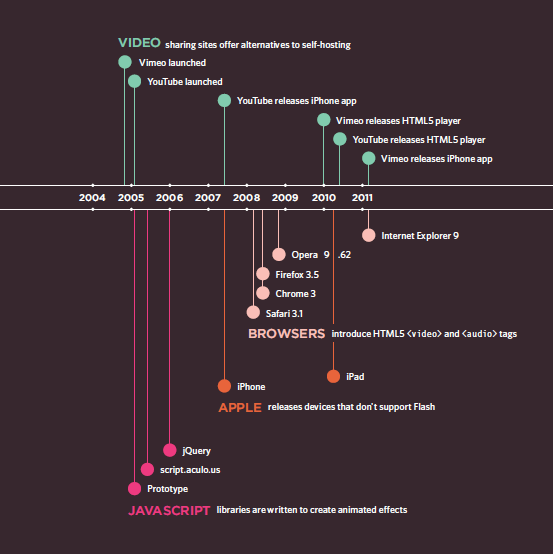

#  Assorted Topics

# Controlling sizes of images in CSS

You can control the size of an
image using the width and
height properties in CSS, just
like you can for any other box.

Specifying image sizes helps
pages to load more smoothly
because the HTML and CSS
code will often load before the
images, and telling the browser
how much space to leave for an
image allows it to render the rest
of the page without waiting for
the image to download.

# AligNi ng images Using CSS
Rather than using the ``````
element's align attribute, web
page authors are increasingly
using the float property to align
images. There are two ways that
this is commonly achieved:

1. The float property is added
to the class that was created to
represent the size of the image.

2. New classes are created with
names such as align-left or
align-right to align the images
to the left or right of the page.
These class names are used in
addition to classes that indicate
the size of the image.



# Background Images
The background-image property allows you to place an image behind any HTML element. This could be the entire page or just part of the page. By default, a background image will repeat to fill the entire box.

* **repeat**-The background image is repeated both horizontally and vertically (the default way it is shown if the backgroundrepeat property isn't used).

* **repeat-x**-The image is repeated horizontally only (as shown in the first example on the left).

* **repeat-y**-The image is repeated vertically only.

* **no-repeat**-The image is only shown once.

# Practical Information
Search Engine Optimization (SEO )
SEO is a huge topic and several books have been written on the subject. The following pages will help you understand the key concepts so you can improve your website's visibility on search engines.

* The Basics
* On-Page Techniques
* Off-Page Techniques

## How to Identify Keywords and Phrases

Determining which keywords to use on your site can be one of the hardest tasks when you start to think about SEO. Here are six steps that will help you identify the right keywords and phrases for your site.


## How Many People Are Coming to Your Site?

The overview page gives you a snapshot of the key information you are likely to want to know. In particular, it tells you how many people are coming to your site.


## What Are Your Visitors Looking At?

The content link on the left-hand side allows you to learn more about what the visitors are looking at when they come to your site.


## Where Are Your Visitors Coming From?

The traffic sources link on the left hand side allows you to learn where your visitors are coming from.


# Flash, Video & Audio


## How Flash Works
Since the late 1990s, Flash has been a very
popular tool for creating animations, and later
for playing audio and video in websites.

# Timeline: Flash, VidEo & Audio






