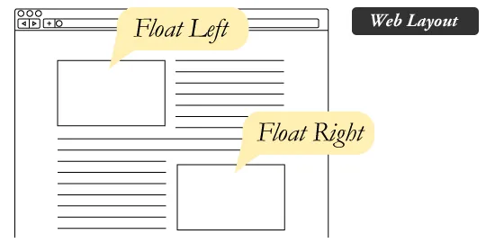

# SMACSS and Responsive Web Design

# Responsive Web Design

Responsive web design is the practice of building a website suitable to work on every device and every screen size, no matter how large or small, mobile or desktop. Responsive web design is focused around providing an intuitive and gratifying experience for everyone. Desktop computer and cell phone users alike all benefit from responsive websites.

## Responsive vs. Adaptive vs. Mobile

* Responsive generally means to react quickly and positively to any change

* Adaptive means to be easily modified for a new purpose or situation, such as change

* Mobile means to build a separate website commonly on a new domain solely for mobile users.

***Responsive web design is broken down into three main components, including:*** Flexible Layouts: flexible layouts, is the practice of building the layout of a website with a flexible grid, capable of dynamically resizing to any width. Flexible grids are built using relative length units, most commonly percentages or em units. These relative lengths are then used to declare common grid property values such as width, margin, or padding.

## Flexible Layouts

Flexible layouts do not advocate the use of fixed measurement units, such as pixels or inches. Reason being, the viewport height and width continually change from device to device. Website layouts need to adapt to this change and fixed values have too many constraints

The formula is based around taking the target width of an element and dividing it by the width of it’s parent element. The result is the relative width of the target element.

```target ÷ context = result```

Media Queries Media queries were built as an extension to media types commonly found when targeting and including styles. Media queries provide the ability to specify different styles for individual browser and device circumstances, the width of the viewport or device orientation.

It uses the @media rule to include a block of CSS properties only if a certain condition is true. for example:
```
@media only screen and (max-width: 600px) {
 body {
      background-color: lightblue;
      }
}
```
In this example, If the browser window is 600px or smaller, the background color will be lightblue.

Flexible Media Media that move and scale with our flexible grid is another key feature of a responsive web design. Flexible Media often give web designers a bit of a headache. Loading in huge, oversized images that we scale down using width and height HTML attributes when we want more space for text content on smaller browsing devices is not a good practice for faster web page load times.

Images, videos, and other media types need to be scalable, changing their size as the size of the viewport changes. One quick way to make media scalable is by using the max-width property with a value of 100%. Doing so ensures that as the viewport gets smaller any media will scale down according to its containers width.
```
img, video, canvas {
    max-width: 100%;
}
```

# Float

**What is “Float”?**

Float is a CSS positioning property. To understand its purpose and origin, we can look to print design. In a print layout, images may be set into the page such that text wraps around them as needed. This is commonly and appropriately called “text wrap”. Here is an example of that.



In web design, page elements with the CSS **float** property applied to them are just like the images in the print layout where the text flows around them. Floated elements remain a part of the flow of the web page. This is distinctly different than page elements that use absolute positioning. Absolutely positioned page elements are removed from the flow of the webpage, like when the text box in the print layout was told to ignore the page wrap. Absolutely positioned page elements will not affect the position of other elements and other elements will not affect them, whether they touch each other or not.

Setting the float on an element with CSS happens like this:

```
#sidebar {
  float: right;			
}
```

**What are floats used for?**

* Floats can be used to create entire web layouts.
* Floats are also helpful for layout in smaller instances.
* The same layout could be accomplished using relative positioning on container and absolute positioning on the avatar as well. 

**The float property has the following possible values:**
* none: no float effect. This is the default.
* left: floats to the left.
* right: floats to the right.
* inherit: inherits the float setting from the parent element.
* initial: sets the float setting to the default value.

## Clearing the Float

Float’s sister property is clear. An element that has the clear property set on it will not move up adjacent to the float like the float desires, but will move itself down past the float.


