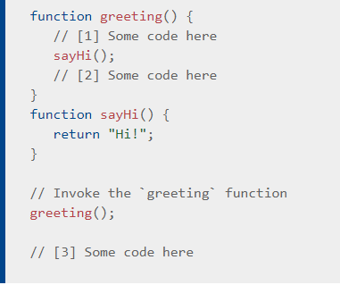

# Call stack
A call stack is a mechanism for an interpreter (like the JavaScript interpreter in a web browser) to keep track of its place in a script that calls multiple functions — what function is currently being run and what functions are called from within that function, etc.

* When a script calls a function, the interpreter adds it to the call stack and then starts carrying out the function.
* Any functions that are called by that function are added to the call stack further up, and run where their calls are reached.
* When the current function is finished, the interpreter takes it off the stack and resumes execution where it left off in the last code listing.
* If the stack takes up more space than it had assigned to it, it results in a "stack overflow" error.



The code above would be executed like this:

1. Ignore all functions, until it reaches the ```greeting()``` function invocation.
2. Add the ```greeting()``` function to the call stack list.

```
Call stack list:
- greeting
```
3. Execute all lines of code inside the greeting() function.
4. Get to the ```sayHi()``` function invocation.
5. Add the sayHi() function to the call stack list.

```
Call stack list:
- sayHi
- greeting
```

6. Execute all lines of code inside the ```sayHi()``` function, until reaches its end.
7. Return execution to the line that invoked ```sayHi()``` and continue executing the rest of the ```greeting()``` function.
8. Delete the ```sayHi()``` function from our call stack list.

```
Call stack list:
- greeting
```

9. When everything inside the ```greeting()``` function has been executed, return to its invoking line to continue executing the rest of the JS code.
10. Delete the ```greeting()``` function from the call stack list.

```
Call stack list:
EMPTY
```

# JavaScript error reference
Below, you'll find a list of errors which are thrown by JavaScript. These errors can be a helpful debugging aid, but the reported problem isn't always immediately clear. The pages below will provide additional details about these errors. Each error is an object based upon the Error object, and has a ```name``` and a ```message```.

Errors displayed in the Web console may include a link to the corresponding page below to help you quickly comprehend the problem in your code.


# List of errors
In this list, each page is listed by name (the type of error) and message (a more detailed human-readable error message). Together, these two properties provide a starting point toward understanding and resolving the error. For more information.