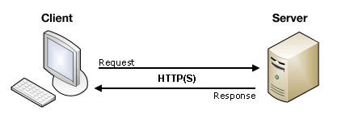

# Update/Delete

# Client/server architecture
* At it's most basic, the web uses a client/server architecture that can be summarized as follows.

* a client (usually a web browser) sends a request to a server.

* using the HTTP protocol. The server answers the request using the same protocol.



An HTML form on a web page is nothing more than a convenient user-friendly way to configure an HTTP request to send data to a server. This enables the user to provide information to be delivered in the HTTP request.

# On the client side: defining how to send the data

The ```<form>``` element defines how the data will be sent. All of its attributes are designed to let you configure the request to be sent when a user hits a submit button. The two most important attributes are ```action``` and ```method```.

## The action attribute
The action attribute defines where the data gets sent. Its value must be a valid relative or absolute URL. If this attribute isn't provided, the data will be sent to the URL of the page containing the form — the current page.

In this example, the data is sent to an absolute URL — https://example.com:

```<form action="https://example.com">```
Here, we use a relative URL — the data is sent to a different URL on the same origin:

```<form action="/somewhere_else">```

When specified with no attributes, as below, the ```<form>``` data is sent to the same page that the form is present on:

```<form>```

## The method attribute
The ```method``` attribute defines how data is sent. The HTTP protocol provides several ways to perform a request; HTML form data can be transmitted via a number of different methods, the most common being the ```GET``` method and the ```POST``` method.

1. **The GET method**

The ```GET``` method is the method used by the browser to ask the server to send back a given resource: "Hey server, I want to get this resource." In this case, the browser sends an empty body. Because the body is empty, if a form is sent using this method the data sent to the server is appended to the URL.

Consider the following form:
```
<form action="http://www.foo.com" method="GET">
  <div>
    <label for="say">What greeting do you want to say?</label>
    <input name="say" id="say" value="Hi">
  </div>
  <div>
    <label for="to">Who do you want to say it to?</label>
    <input name="to" id="to" value="Mom">
  </div>
  <div>
    <button>Send my greetings</button>
  </div>
</form>
```

2. **The POST method**

The ```POST method``` is a little different. It's the method the browser uses to talk to the server when asking for a response that takes into account the data provided in the body of the HTTP request: "Hey server, take a look at this data and send me back an appropriate result." If a form is sent using this method, the data is appended to the body of the HTTP request.

Let's look at an example — this is the same form we looked at in the ```GET``` section above, but with the method attribute set to ```POST```.

```
<form action="http://www.foo.com" method="POST">
  <div>
    <label for="say">What greeting do you want to say?</label>
    <input name="say" id="say" value="Hi">
  </div>
  <div>
    <label for="to">Who do you want to say it to?</label>
    <input name="to" id="to" value="Mom">
  </div>
  <div>
    <button>Send my greetings</button>
  </div>
</form>
```


