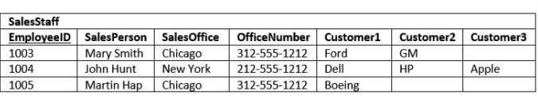

# Database Normalization

**Database normalization:** is a process used to organize a database into tables and columns.  The main idea with this is that a table should be about a specific topic and only supporting topics included. Take a spreadsheet containing the information as an example, where the data contains salespeople and customers serving several purposes:
* Identify salespeople in your organization.
* List all customers your company calls upon to sell a product.
* Identify which salespeople call on specific customers.

# Reasons for Database Normalization
There are three main reasons to normalize a database.
* The first is to minimize duplicate data. 
* The second is to minimize or avoid data modification issues.
* The third is to simplify queries. 

I think once you understand the issues, you better appreciate normalization. Consider the following table:



Note: The primary key columns are underlined
The first thing to notice is this table serves many purposes including:

* Identifying the organization’s salespeople
* Listing the sales offices and phone numbers
* Associating a salesperson with an sales office
* Showing each salesperson’s customers

# Data Duplication and Modification Anomalies
Notice that for each SalesPerson we have listed both the SalesOffice and OfficeNumber. There are duplicate salesperson data. Duplicated information presents two problems:

* It increases storage and decrease performance.
* It becomes more difficult to maintain data changes.

# Search and Sort Issues
The last reason we’ll consider is making it easier to search and sort your data.  In the SalesStaff table if you want to search for a specific customer such as Ford, you would have to write a query like:
```
SELECT SalesOffice
FROM SalesStaff
WHERE Customer1 = ‘Ford’ OR
      Customer2 = ‘Ford’ OR
      Customer3 = ‘Ford’
```

# Definition of Database Normalization
There are three common forms of database normalization: 1st, 2nd, and 3rd normal form. They are also abbreviated as 1NF, 2NF, and 3NF respectively. 

The forms are progressive, meaning that to qualify for 3rd normal form a table must first satisfy the rules for 2nd normal form, and 2nd normal form must adhere to those for 1st normal form. Before we discuss the various forms and rules in detail, let’s summarize the various forms:

* First Normal Form – The information is stored in a relational table with each column containing atomic values. There are no repeating groups of columns.
* Second Normal Form – The table is in first normal form and all the columns depend on the table’s primary key.
* Third Normal Form – the table is in second normal form and all of its columns are not transitively dependent on the primary key.

