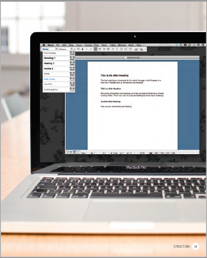
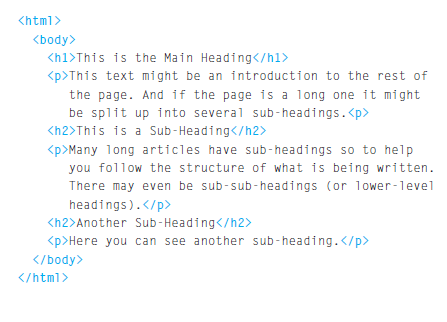
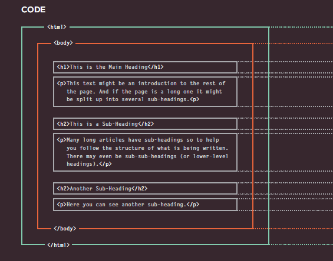
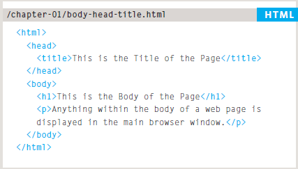
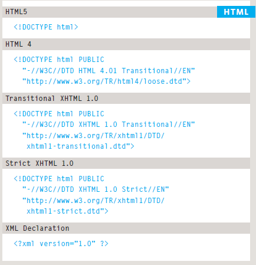
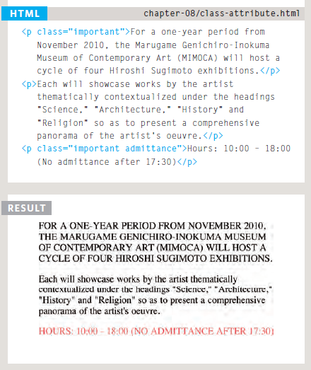
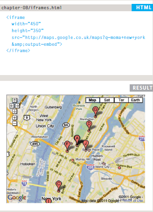

# We come across all kinds of documents every day of our lives. Newspapers, insurance forms, shop catalogues... the list goes on.

<br>
Many web pages act like electronic versions of these
documents. For example, newspapers show the same stories
in print as they do on websites; you can apply for insurance
over the web; and stores have online catalogs and e-commerce
facilities.

<br>
In all kinds of documents, structure is very important in helping
readers to understand the messages you are trying to convey
and to navigate around the document. So, in order to learn how
to write web pages, it is very important to understand how to
structure documents.
<br>
<br>

# How Pages Use Structure
* Structure helps readers
understand the stories in the
newspaper.
* The structure is very similar
when a news story is viewed
online (although it may also
feature audio or video).


<br>
<br>

# Structuring Word Documents

* The use of headings and subheadings in any document
often reflects a hierarchy of information. 

* This might be expanded upon under subheadings lower down on the page. When using a word
processor to create a document, we separate out the text to give it structure. Each topic might
have a new paragraph, and each section can have a heading to describe what it covers.



<br>
<br>

# HTML Describes the Structure of Pages

The HTML code (in blue) is made up of characters that live inside angled brackets — these are called HTML elements. Elements are usually made up of two tags: an opening tag and a closing tag. (The closing tag has an extra forward slash in it.) Each HTML element tells the browser something about the information that sits between its opening and
closing tags.



<br>
<br>

# HTML Uses Elements to Describe the Structure of Pages

Let's look closer at the code.There are several different elements. Each element has an opening tag and a closing tag.



Tags act like containers. They tell you
something about the information that lies
between their opening and closing tags.


<br>
<br>

# Attributes Tell Us More About Elements

Attributes provide additional information
about the contents of an element. They appear
on the opening tag of the element and are
made up of two parts: a name and a value,
separated by an equals sign.


The majority of attributes can only be used on certain elements, although a few attributes (such as lang) can appear on any element.Most attribute values are either pre-defined or follow a
stipulated format. We will look at the permitted values as we introduce each new attribute.
The value of the lang attribute is an abbreviated way of specifying which language is used inside the element that all browsers understand.
<br>
<br>

# Body, Head & Title

## 1. Body
You met the **body** element
in the first example we created.
Everything inside this element is
shown inside the main browser
window.


## 2. Head
Before the **body** element you
will often see a **head** element.
This contains information
about the page (rather than
information that is shown within
the main part of the browser
window that is highlighted in
blue on the opposite page).
You will usually find a **title**
element inside the **head**
element.

## 3. Title
The contents of the **title**
element are either shown in the
top of the browser, above where
you usually type in the URL of
the page you want to visit, or
on the tab for that page (if your
browser uses tabs to allow you
to view multiple pages at the
same time).



<br>
<br>

# The Evolution of HTML
Since the web was first created, there have
been several different versions of HTML.
Each new version was designed
to be an improvement on the
last (with new elements and
attributes added and older code
removed).

## 1. HTML 4 Released 1997
With the exception of a few
elements added in HTML5
(which have been highlighted),
the elements you have seen in
 were all available in
HTML 4.
Although HTML 4 had some
presentational elements to
control the appearance of pages,
authors are not recommended to
use them any more.

## 2. XHTML 1.0 Released 2000
In 1998, it was a language called XML
Has been published. Purpose
It was to allow people to write
New markup languages. Ago
HTML was the most commonly used
The markup language around, it was
they decided that HTML 4 should be
Paraphrased to follow the rules
From XML and renamed
XHTML. This means that
The authors had to follow some new,
Stricter rules about writing
Tick on.

* Every element needed a
closing tag (except for empty
elements such as img ).

* Attribute names had to be in
lowercase.
* All attributes required a value,
and all values were to be
placed in double quotes.
* Deprecated elements should
no longer be used.
* Every element that was
opened inside another
element should be closed
inside that same element.

## 3. HTML5 Released 2000
In HTML5, web page authors do
not need to close all tags, and
new elements and attributes will
be introduced. At the time of
writing, the HTML5 specification
had not been completed, but
the major browser makers had
started to implement many of
the new features, and web page
authors were rapidly adopting
the new markup.
<br>
<br>

## Doctype 
 Because there have been several versions of HTML, each web page should begin with a :

* DOCTYPE declaration to tell a
browser which version of HTML
the page is using (although
browsers usually display the
page even if it is not included).
* The use of a DOCTYPE
can also help the browser to
render a page correctly.
Because XHTML was written
in XML, you will sometimes.
* See pages that use the XHTML
strict DOCTYPE start with
the optional XML declaration.
Where this is used, it should be
the first thing in a document.
There must be nothing before it,
not even a space. 



<br>
<br>

## Comments in HTML
If you want to add a comment
to your code that will not be
visible in the user's browser, you
can add the text between these
characters:

```<!-- comment goes here --> ```

Why It is a good idea to add
comments to your code
* because,
no matter how familiar you
are with the page at the time
of writing it, when you come
back to it later (or if someone
else needs to look at the code),
comments will make it much
easier to understand.
* Although comments are not
visible to users in the main
browser window, they can be
viewed by anyone who looks at
the source code behind the page.
* Comments can also be used
around blocks of code to stop
that code from being displayed
in the browser.
<br>
<br>

## Class Attribute
* Every HTML element can
also carry a class attribute.

* Sometimes, rather than uniquely
identifying one element within
a document, you will want a
way to identify several elements
as being different from the
other elements on the page.
To do this you can use the
class attribute. Its value
should describe the class it
belongs to.

* The class attribute on any
element can share the same
value.


<br>
<br>

## Block Elements
Some elements will always
appear to start on a new line in
the browser window. These are
known as block level elements.
Examples of block elements are
(```<h1>, <p>, <ul>, and <li>```).

## Inline Elements
Some elements will always
appear to continue on the
same line as their neighbouring
elements. These are known as
inline elements.
Examples of inline elements are
<```<a>, <b>, <em>, and ```).
<br>
<br>

## Grouping Text & Elements In a Block

**1.** **```<div> ```**

The ```<div>``` element allows you to
group a set of elements together
in one block-level box.


<br>
<br>

## Grouping Text & Elements Inline

**```<span> ```**

The ```<span>``` element acts like
an inline equivalent of the ```<div>```
element. It is used to either:
1.  Contain a section of text
where there is no other suitable
element to differentiate it from
its surrounding text
2.  Contain a number of inline
elements
The most common reason why
people use <span> elements
is so that they can control the
appearance of the content of
these elements using CSS.

**```<span>```** elements:
*  To explain the purpose of this
```<span>``` element
*  So that CSS styles can be
applied to elements that
have specific values for these
attributes.


<br>
<br>

## IFrames

**```<iframe>```**

An iframe is like a little window
that has been cut into your
page — and in that window you
can see another page. The term
iframe is an abbreviation of inline
frame.

An iframe is created using the
```<iframe> ```element. There are a
few attributes that you will need
to know to use it:
* **src**
The src attribute specifies the
URL of the page to show in the
frame.
* **height**
The height attribute specifies
the height of the iframe in pixels.
* **width**
The width attribute specifies
the width of the iframe in pixels.


<br>
<br>

# Information About Your Pages

**1.** ```<meta>```

The ```<meta>``` element lives
inside the ```<head>``` element and
contains information about that
web page.
* It is not visible to users but
fulfills a number of purposes
such as telling search engines
about your page, who created
it, and whether or not it is time
sensitive.
* The ```<meta>``` element is an empty
element so it does not have a
closing tag. It uses attributes to
carry the information.
* The most common attributes
are the name and content
attributes, which tend to be
used together. These attributes
specify properties of the entire
page. The value of the name
attribute is the property you
are setting, and the value of the
content attribute is the value
that you want to give to this
property.

Some defined values for this
attribute that are commonly
used are:

    1. description
     This contains a description of the page.
    2. keywords
      This contains a list of commaseparated
      words that a user might search on to 
      find the page.
    3. robots
      This indicates whether search
      engines should add this page
      to their search results or not.

The ```<meta>``` element also
uses the http-equiv and
content attributes in pairs.Each one has a
different purpose:
* author
This defines the author of the
web page.
* pragma
This prevents the browser from
caching the page. (That is,
storing it locally to save time
downloading it on subsequent
visits.)
* expires
Because browsers often cache
the content of a page, the
expires option can be used
to indicate when the page
should expire (and no longer be
cached).
<br>
<br>


